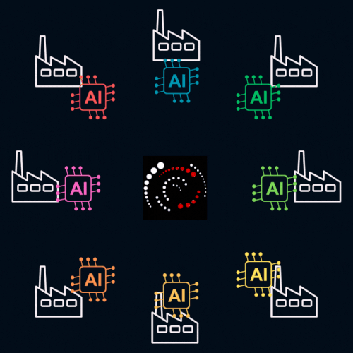

# 🚀 Ariadne Engine On-Premises: Your Private AI Data Intelligence

<div align="center">
  
</div>

**Automate complex AI workflows on your data — without losing control.**

The **Ariadne Engine** is a **meta-system for data intelligence**, designed to **autonomously process and connect your data** using AI agents, knowledge graphs, and modular workflows. Unlike traditional LLM interfaces, it abstracts away the complexity of managing models and interactions — so you can focus on **extracting actionable insights from your data**.

Built by **Ariadne Industries GmbH**, it is the technical backbone of **[Ariadne Anyverse](https://www.ariadneanyverse.de)**, a digital ecosystem where **data sovereignty meets AI automation**.

---

## 🚀 Release v0.1.0: Stable & Ready for Data Intelligence

### What’s New?

🔥 The Ariadne Engine **v0.1.0** is now **stable and production-ready**. 

You can:

✅ **Build knowledge graphs**: Index documents and connect data into a dynamic intelligence layer.

✅ **Use pre-built agents**: Interact with internal agents via chat or custom workflows.

✅ **Integrate external systems**: Connect to any MCP-compatible service (e.g., APIs, databases) using [Model-Context Protocol](https://modelcontextprotocol.io/docs/getting-started/intro) servers.

✅ **Customize workflows**: Define your own logic with Python scripts in the `flow-scripts/` directory.

### Roadmap: What’s Next?

We’re already working on **v0.2.0**, which will bring:
- **Advanced Scheduler**: Automate tasks and workflows with time-based triggers.
- **Enhanced Meta-Agent System**: Agents that can **reason across longer contexts**, search deeper in your data, and execute complex tasks autonomously.
- **Improved Knowledge Graph and Dataindex Abstraction**: Simpler ways to query and update your intelligence layer.

> **Stay tuned!** Follow our [GitHub](https://github.com/Ariadne-Industries-GmbH) or [LinkedIn](https://linkedin.com/company/ariadne-industries) for updates.


---

## 🎯 Who Is This For?

The Ariadne Engine is tailored for:

- **Developers** who want to build **autonomous AI workflows** without reinventing the wheel.
- **Enterprises** needing **GDPR-compliant, on-premises data intelligence**.
- **Power users** who want to **unlock value from their data** using agentic automation.

---

## 🔥 Why a Meta-System?

Most LLM tools require you to manage models, agents, and workflows manually. The Ariadne Engine **handles the complexity for you**:

✅ **Agentic automation**: Internal agents interact with LLMs, VLMs, and embeddings — **you define the workflows, not the infrastructure**.

✅ **Knowledge graphs**: Your data becomes a **connected intelligence layer**, enabling long-term reasoning across documents, APIs, and internal systems.

✅ **Full control**: Deploy on-premises for maximum privacy or use our cloud version (hosted in Germany, GDPR-compliant).

> **Not just another LLM frontend**: The engine is designed to **orchestrate multi-modal AI workflows** — think of it as a **private AI operating system** for your data.

---

## 🎯 Core Capabilities

| Feature               | Description                                                                 |
|-----------------------|-----------------------------------------------------------------------------|
| **Agentic Workflows** | Autonomous agents handle tasks like document processing, API integrations, or knowledge updates. Define workflows in Python and let the engine execute them. |
| **Knowledge Graphs**  | Your data is structured as a **dynamic intelligence layer**, enabling cross-references and long-term context. *(No raw storage -> connected insights.)* |
| **Modular AI Integration** | Supports LLMs, VLMs, and embeddings via APIs (e.g., Ollama, Lama.cpp, or cloud providers). Configure once, use flexibly. |
| **Privacy by Design**  | Local-only processing or cloud privacy tiers — your choice. Hosted in Germany for compliance. |

---

## 🦸 The Engine’s Superpowers

### 📦 What’s Inside?

The Ariadne Engine comes with:
1. **Pre-configured agentic workflows**: Start automating tasks like document analysis or API integrations out of the box.
2. **Knowledge graph infrastructure**: FalkorDB-powered storage for your data as a connected intelligence layer.
3. **Meta Agents**: Autonomous AI agents that interact with your data, models, and external systems on your behalf.
4. **UI Webapp**: A dashboard to visualize workflows, manage knowledge graphs, and chat with agents.

### 🔒 Privacy & Control

Choose how your data is processed:
- **Local-only**: All workflows run on your hardware.
- **Cloud privacy tiers**: Use our GDPR-compliant cloud LLMs (hosted in Germany) while keeping sensitive data on-premises.

> **Test the minimal cloud version for a first look**: [https://ai.ariadneanyverse.de](https://ai.ariadneanyverse.de)

---

## 🛠️ Get Started in 5 Minutes

### Requirements:

- [ ] **Docker** (v20.10+)
- [ ] **Docker Compose** (v1.29+)
- [ ] **GPU recommended**
- [ ] **16GB RAM minimum**

> **Pro Tip**: Use our [`docker-compose-example.yml`] as a starting point. It includes all services (LLM servers, VLM, embeddings, Graph DB and the engine itself).

---

## Configuration Files

**The engine requires two key configuration files to run:**

### model_config.json (Required)

Tells the engine which models to use and how to connect to them.

**Example:**

```json
{
    "ministral-14b": { // This key corresponds to the display name of this model in the UI.
      "url": "http://host.docker.internal:44410", // make sure the llm server is reachable from within the engine docker container
      "service_type": "llama.cpp", // Supported types: 'ollama' or 'llama.cpp'.
      "temperature": 0.15
    },
  "ministral-3b": {
    "url": "http://host.docker.internal:44408", // make sure the llm server is reachable from within the engine docker container
    "service_type": "llama.cpp",
    "temperature": 0.15 // Optional parameter with default values (e.g., 0.7). Can be omitted if no customization is needed. More params added in future versions
  }
}

```

> ⚠️ The engine will fail to start in the local deployoment mode without this file and at least one model!

### mcp_servers.json (Required)

**Configures plugins and external integrations (e.g., APIs, databases).**

 We follow closely the Claude Desktop Config so you can mostly copy the config for any given MCP Server.

**Examples**

```json
{
  "mcpServers": {
    "osm-mcp-server": {
      "name": "OpenStreetMap Location-Based App MCP Server",
      "description": "A Tool for the AI to search for places and routes.",
      "transport": "stdio",
      "command": [
        "./mcps/osm_mcp_server"
      ],
      "url": null,
      "bearer_token": null,
      "env": null,
      "tags": null,
      "created_at": "2025-04-28"
    },
    "mcp-email-server": {
      "name": "E-Mail MCP Server",
      "description": "A connector for using default SMTP and IMAP E-Mail Servers.",
      "transport": "stdio",
      "command": [
        "./mcps/mcp_email_server_bin",
        "stdio"
      ],
      "url": null,
      "bearer_token": null,
      "env": {"MCP_EMAIL_SERVER_CONFIG_PATH": "./mcps/mcp_email_server/config.toml"},
      "tags": null,
      "created_at": "2025-06-06"
    },
    "mcp-filesytem": {
      "name": "Filesystem MCP Server",
      "description": "A connector for using the local filesystem, restricted on given directories.",
      "transport": "stdio",
      "command": [
        "./mcps/mcp-filesystem",
        "stdio",
        "/home/user/filesystem",
      ],
      "url": null,
      "bearer_token": null,
      "env": null,
      "tags": null,
      "created_at": "2025-09-08"
    }
  }
}
```

> ⚠️ You need at least an empty `mcp_config.json` otherwise the Engine will NOT start!


**Minimal MCP Config**

```json
{
  "mcpServers": {
  }
}
```

---

## Deploy Like a Pro: Docker Setup

### Directory Structure

Create the following **required** directory structure in your project root:

```
project_root/
├── databases/
│   └── falkordb/         # FalkorDB data (auto-created)
├── models/
│   ├── docling/          # Docling models (auto-downloaded)
│   ├── faster-whisper/   # Faster-whisper models (auto-downloaded)
│   └── others/           # LLM, VLM, and Embeddings models
└── flow-scripts/         # Custom Python flow scripts (Required)
```

> ⚠️ The absence of any configuration files or directories mentioned above (`model_config.json`, `mcp_servers.json`) will cause the engine to fail during startup.

> ⚠️ **First run takes time**: The engine auto-downloads `docling` and `faster-whisper` models (~10 min).

> **Pro Tip**: Use our [`docker-compose-example.yml`] to avoid common pitfalls.


### AI Model Dependencies

Ensure the following models are available in their respective directories:

1. **LLM Models**:

  You can use additional LLM models by downloading them from Hugging Face and hosting them via `llama.cpp` or `ollama`. 
  Add configurations for these models in the `model_config.json` file under their desired display names.

  Models, that we currently recommend:
    - https://huggingface.co/unsloth/Ministral-3-14B-Instruct-2512-GGUF
    - https://huggingface.co/unsloth/Ministral-3-8B-Instruct-2512-GGUF
    - https://huggingface.co/unsloth/Ministral-3-3B-Instruct-2512-GGUF
    - Place the downloaded file in `./models/others/` if you follow the docker compose example of this repository.

2. **VLM Model**:
 
  You can use additional VLM models by downloading them from Hugging Face and hosting via `llama.cpp`.
  You can also point AAA_LLAMA_VLM_BASE_URL to any other OpenAI-compliant VLM API, but others then llama.cpp with SmolVLM2 is currently not tested.
  The flexibility to configure other VLMs (e.g., OpenAI-compliant APIs) is planned for future releases.
  Currently recommended model: SmolVLM2-500M-Video-Instruct (fast on CPU, suitable for document processing).
     - https://huggingface.co/ggml-org/SmolVLM2-500M-Video-Instruct-GGUF
     - Place the downloaded file in `./models/others/` if you follow the docker compose example of this repository.

3. **Embeddings Model**:
  
   You can use additional embedding models by downloading them from Hugging Face and hosting via `llama.cpp`. The `AAA_EMBEDDINGS_BASE_URL` in the Docker Compose file allows you to point to any `llama.cpp`-compatible server or OpenAI-compliant embedding APIs. (currently only llama.cpp is tested)
   Currently recommended model: BGE-M3, which is fast on CPU and suitable for text processing pipelines.
      - https://huggingface.co/bbvch-ai/bge-m3-GGUF
      - Place the downloaded file in `./models/others/` if you follow the repository's Docker Compose example.


4. **Faster-whisper & Docling Models**:
   These are automatically downloaded by the engine if missing from their respective directories (`./models/faster-whisper` and `./models/docling`).

> We provide a few Docker Compose setups with `llama.cpp` for some good local open source LLMs in `docker-compose-llms.yml`

---

### Docker Compose Example (Backend)

Deploy using `docker-compose.yml`. Below is the **official configuration** based on `docker-compose-example.yml`:

```yaml
services:
  ariadne-engine:
    image: ariadneindustries/ariadne-engine:0.1.0-rc.3-on-prem
    restart: "no"
    user: "${HOST_UID}:${HOST_GID}" # you can try to configure this to have better access to files on your host the engine creates within the docker container. OPTIONAL.
    ports:
      - "44444:44444"
    extra_hosts:
      - "host.docker.internal:host-gateway"
    volumes:
      - ./databases:/app/aaa-bundle/databases
      - ./models/docling:/app/aaa-bundle/models/docling:ro
      - ./models/faster-whisper:/app/aaa-bundle/models/faster-whisper
      - ./flow-scripts:/app/aaa-bundle/flow-scripts:ro
      - ./mcp_servers.json:/app/aaa-bundle/mcp_servers.json:ro
      - ./model_config.json:/app/aaa-bundle/model_config.json:ro
    environment:
      - AAA_IDP_HOST=http://host.docker.internal:8000 # Defaults to "https://idp.ariadneanyverse.de" **but ignored if AAA_IDENTITY_SOURCE=integrated-idp**
      - AAA_LLAMA_VLM_BASE_URL=http://llama-vlm-server:44409/v1 # Required for VLM functionality. **Error if not set.**
      - AAA_EMBEDDINGS_BASE_URL=http://llama-cpp-embedding-server:44441/v1 # Required for embeddings functionality. **Error if not set.**
      - AAA_IS_PRIVACY_LEVEL_EXCLUSIVE_ENABLED=true # Defaults to true. Enables Exclusive LLMs based on model_config.json (default for local-only configurations). 
      - AAA_IS_PRIVACY_LEVEL_PREMIUM_ENABLED=false # Defaults to true. When enabled, use Premium-level privacy LLMs provided by Ariadne Industries.
      - AAA_IS_PRIVACY_LEVEL_STANDARD_ENABLED=false # Defaults to true. When enabled, use Standard-level privacy LLMs provided by Ariadne Industries.
      - AAA_ACTIVATE_WEB_SEARCH_SUBAGENT=false # Defaults to false. When disabled, web search subagent is inactive. Currently not supported locally.
      - AAA_FASTER_WHISPER_MODEL=small # default is large-v3-turbo. Small is good for most cases and fast on cpu
      - AAA_FALKORDB_HOST=falkordb # Defaults to "host.docker.internal". Must match the container name in `docker-compose.yml` if using a separate FalkorDB instance.
      - AAA_FALKORDB_PORT=6379 # Overrides default port of 44400. Only required if connecting to an external FalkorDB instance on non-default ports.
      - AAA_FALKORDB_PASSWORD=${AAA_FALKORDB_PASSWORD:-default} # Defaults to "default" if not set
      # - AAA_LOCAL_AAA_PORT=44444 # defaults to 44444 -> sets in this setup the port for all microservices
      - AAA_IDENTITY_SOURCE=integrated-idp # default is ariadne-anyverse, for local setup it should be integrated-idp.
      - AAA_WORKER_PROCESSES=2 # Overrides default of 4 workers. Each worker uses around **4GB of RAM**.
    networks:
      - ariadne-network
```

See `docker-compose-example.yml` in this repository for a full setup including `llama.cpp` servers.

### Environment Variables

Create a `.env` file with the following variables (adjust as needed):

```
HOST_UID=1000
HOST_GID=1000
```
---

### 🗃️ Storage Dependencies: How Data is Managed

The Ariadne Engine uses **two types of storage** for your data, depending on your needs:

#### 1. **User-Specific Embedded Databases**

- **Location**: Automatically created in the `databases/` folder (e.g., `./databases/user_123/`).
- **What’s stored**:
  - User-specific configurations.
  - Temporary or session-based data.
  - Embedded databases (e.g., SQLite) for lightweight storage.
  - Uploaded Files
- **How it works**:
  The engine **manages these folders automatically**. No manual setup is required — each user gets their own isolated storage.

#### 2. **FalkorDB (Required for Knowledge Graphs)**

- **Location**: Defaults to `./databases/falkordb/` (configurable via Docker Compose).
- **What’s stored**:
  - Your **knowledge graphs** (structured, connected data from documents/APIs/etc.).
  - Long-term memory and complex graph based queries.
- **How to set it up**:
  The engine **requires FalkorDB** for knowledge graph functionality. We recommend deploying it as a Docker container:
  ```yaml
  # Example from our docker-compose-example.yml
  falkordb:
    image: falkordb/falkordb:latest
    restart: "no"
    ports:
      - "${AAA_FALKORDB_PORT:-44400}:6379"
      - "3000:3000" # optional Web UI
    environment:
      # Redis-Args (Persistenz + Sicherheit + Sichtbarkeit)
      REDIS_ARGS: "--protected-mode yes --bind 0.0.0.0 --requirepass ${AAA_FALKORDB_PASSWORD:-default} --appendonly yes --appendfsync everysec --aof-use-rdb-preamble yes --save 3600 1 --save 300 100 --save 60 10000 --dbfilename dump.rdb"
      # FalkorDB-Args (z.B. Threads)
      FALKORDB_ARGS: "THREAD_COUNT 4"
    volumes:
      - ./databases/falkordb:/var/lib/falkordb/data
    healthcheck:
      test: ["CMD-SHELL", "redis-cli -a ${AAA_FALKORDB_PASSWORD:-default} PING | grep -q PONG"]
      interval: 10s
      timeout: 3s
      retries: 10
    stop_grace_period: 20s
    networks:
      - ariadne-network
  ```
- **Key Notes**:
  - FalkorDB is **not mandatory** for basic engine functionality (e.g., chat, simple workflows).
  - **Required** for knowledge graphs, advanced queries, or long-term data connections.
  - The path can be changed in your `docker-compose.yml` if needed.

---

## 🔧 Flow Scripting: Extend the Engine with Python

The `flow-scripts/` directory enables you to **extend the engine’s functionality** with Python scripts.
Here is where you define **custom workflows** using Python. These scripts allow you to:
- **Integrate custom logic** into the engine’s agentic workflows.
- **Automate complex tasks** (e.g., data processing, API calls, or multi-step reasoning).
- **Extend functionality** beyond pre-built agents.

### 📌 Current Status

- **No official documentation yet**: Flow scripting is available now, but we’re working on comprehensive guides.
- **Unstable API**: Flow scripting currently uses the low level engine APIs which may change and does not yet provide stable building blocks.
- **Need help?** Contact [Ariadne Industries](https://www.ariadneanyverse.de/contact) for customization support or to discuss your use case.

---

## 📂 Directory Structure for Flow Scripts

To use custom workflows (including the knowledge graph flows), your `flow-scripts/` directory must follow this structure:

**Example:**

```
flow-scripts/
├── __init__.py           # REQUIRED: Imports all flow modules.
├── flow_scripts          # We prefere to create flow scripts in another subfolder and import them from there into __init__.py
  └── my_custom_workflow.py  # Your custom Python scripts here.
└── utils/                 # OPTIONAL / EXAMPLE You can add any subfolder or submodule you need and import it in your Flow Script
```

---

### ✨ Pre-Built Knowledge Graph Flows

1. **Advanced Knowledge Graph Construction Flow** *(Currently Complex, but Functional)*
   - **Purpose**: **Idempotently builds a knowledge graph** from your uploaded files using the engine’s internal features and stores it persistently in the graph database.
   - **How it works**:
     - Processes all files in the engine’s file index.
     - Uses the engine’s AI capabilities to extract and connect information into a structured graph.
     - Stores the graph internally for future queries.
   - **Note**: This script is currently complex but fully functional. We’re working on simplifying it and improving documentation.
2. **Simple Knowledge Graph Index Query Flow**
   - **Purpose**: Query the current state of the knowledge graph indexation of your file index.
   - This is also a simple showcase on how to build your own flow with Python.

### 📌 How to Use These Flows in the Web App

To utilize these flows in the Ariadne Webapp:
1. Place the provided `flow-scripts` from the `flow-scripts` folder including the `__init__.py` and the subfolder into your **engine’s `flow-scripts/` directory**.
2. Restart the engine to load the new scripts.
3. Use the Webapp’s **AI File Explorer** and in there the "AI File Index" to start the graph creation with your uploaded files.

---

## 🖥️ Ariadne Webapp: Your Control Center

The **Ariadne Webapp** is your dashboard for:
- Visualizing agentic workflows.
- Managing knowledge graphs.
- Interacting with Meta Agents via chat.

### 🔗 How It Connects to the Engine
1. The UI must run **alongside** a `ariadne-engine`. The Engine and Webapp can be configured to run on different servers. Multiple Webapps can use one Engine.
2. Set `AAA_ENDPOINT_URL` in the Webapp’s `.env` to point to your engine (`http://localhost:44444/endpoint`).
3. For local setups, ensure `IDP_BASE_URL` points to the engine’s integrated IDP:
   ```bash
   IDP_BASE_URL=http://host.docker.internal:44444/integrated_idp
   ```

### Usage Example (Webapp)

Deploy the UI webapp using `docker-compose.yml`. Add the following service to your existing configuration:

```yaml
services:
  ariadne-webapp:
    image: ariadneindustries/ariadne-webapp:0.1.0-rc.2-web-bff
    restart: unless-stopped
    ports:
      - "43380:80"   # HTTP port for accessing the webapp
      - "44380:443"  # HTTPS port (optional, not properly supported, please use a Proxy server if you need TLS)
    extra_hosts:
      - "host.docker.internal:host-gateway"
    environment:
      - AAA_ENDPOINT_URL=http://host.docker.internal:44444/endpoint # Required. Must point to the active Ariadne Engine backend.
      - IDP_BASE_URL=http://host.docker.internal:44444/integrated_idp # For **local setups**, MUST point to the integrated_idp of the engine (no other options available).
    networks:
      - ariadne-network
```

> The `AAA_ENDPOINT_URL` must be set to the same port as your Ariadne Engine backend (`44444`). Ensure that the `IDP_BASE_URL` points to the integrated IDP of the engine.

---

### Verification & Troubleshooting (UI + Backend)

#### 1. **Verify UI Connectivity**:

   - Open a browser and navigate to `http://localhost:43380` (or `https://localhost:44380`).
   - Ensure the UI loads correctly and displays data from the engine.

#### 2. **Check for Common Issues**:

   - If the webapp fails to load, verify that the Ariadne Engine backend is running (`docker ps`) and that environment variables are set correctly.
   - For authentication errors, ensure `IDP_BASE_URL` points to the integrated_idp of the engine (`44444/integrated_idp`).

#### 3. **Verify Backend Connectivity**:

   Check service logs for any errors:
   ```bash
   docker logs <container_name>
   ```

#### 4. Verify connectivity to the required ports:

   - Ariadne Engine: **44444**
   - LLM GPU Server: **44410** -> Port depends on your setup and how you configured the local models in `model_config.json`. **It is up to you what and how many LLMs you use**
   - LLM CPU Server: **44408** -> Port depends on your setup and how you configured the local models in `model_config.json`. **It is up to you what and how many LLMs you use**
   - VLM Server: **44409**
   - Embeddings Server: **44441**

#### 5. **Missing Configuration Files/Directories**:

   If any of the following are missing, the engine will fail to start or function properly:
   - `model_config.json` (Required for model endpoint configuration).
   - `mcp_servers.json` (Required for synchronizing MCP-based plugins into the database).
   - `./flow-scripts/` directory (Required for loading custom flow scripts).

---

### Starting the Services

1. Run the following command in the project root directory to start both the Ariadne Engine and the UI webapp:
   ```bash
   docker-compose up -d
   ```

2. Verify that all services are running properly:
   ```bash
   docker ps
   ```

---

## Additional Resources

- [Ariadne Engine GitHub Repository](https://github.com/Ariadne-Industries-GmbH/Ariadne-Engine) (Official documentation)

## 🚀 Join the Vision

Interested in how the Ariadne Engine fits into the bigger picture?
- Check out the **[Ariadne Anyverse vision](https://www.ariadneanyverse.de/)** (digital ecosystem for data sovereignty).
- Follow our **[B2B & B2C activities](https://www.linkedin.com/company/ariadneanyverse/)** for updates.

## License

**Custom license/usage permission** 
- users may pull and run the Docker image and use the engine for private use, including commercial use, but cannot redistribute. 
- all rights belong to Ariadne Industries GmbH and Fabian Fuchs
- See https://www.ariadneanyverse.de/Annex_On-premise_License_Terms.pdf

By downloading and using our Software, you agree with the License Terms given.

### License TLDR

**1 Scope & Definitions**
1. These license terms apply to every installation of the software within the customer’s IT
environment (“on-premise”). A user account with the provider is not required for this.
2. The customer is the company designated in the offer/agreement to whom the software is licensed.
3. An instance refers to a functional copy of the software on a server or container system of the customer.
   
**2 Grant of License**
1. The provider grants the customer a simple, non-transferable, non-sublicensable right to
use the software for the customer’s internal business purposes.
2. Unless otherwise specified in the offer, the license is perpetual and is not limited by
quantity or performance.
3. Source code or object code is not transferred.

**3 Usage Restrictions**
The customer shall in particular not:
- make the software available to or lease it to third parties;
- reverse engineer, decompile, or disassemble the software (cf. § 69e German Copyright
Act [UrhG]), unless legally required and the provider refuses the necessary cooperation;
- remove or alter protection notices, logos, or copyright statements;
- publish the results of benchmarks without prior written consent.

The last point excludes issues and bugs, which can be reported publically in this Github Repository, so we
can fix them as soon as possible.