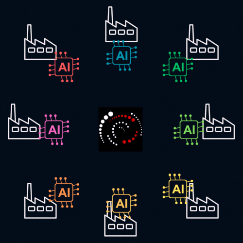

# 🚀 Ariadne Engine: Your Private AI Data Intelligence

<div align="center">
  
</div>

**Automate complex AI workflows on your data — with your private AI operating system**

The **Ariadne Engine** is a **meta-system for data intelligence**, designed to **autonomously process and connect your data** using AI agents, knowledge graphs, and modular workflows. Unlike traditional LLM interfaces, it abstracts away the complexity of managing models and interactions — so you can focus on **extracting actionable insights from your data**.

Built by **Ariadne Industries GmbH**, it is the technical backbone of the **[Ariadne Anyverse](https://www.ariadneanyverse.de)**, a digital ecosystem where **data sovereignty meets AI automation**.

---

## 🚀 Release v1.0.0: Workspaces, Knowledge Graph Creation & the New Embedded Graph Core

### What's New Since v0.3.1?

🔥 **v1.0.0** is the first general-availability release of the Ariadne Engine. It adds workspace file management, guided knowledge graph creation, lightweight direct-to-use chats, the new embedded Ladybug graph core, a standalone speech-recognition service, and a hardened monolith deployment, which increases the performance and the security.

✅ **Workspaces & File Explorer**: Browse, upload, and download the files of an AI workspace in the new workspace explorer, with per-user access policies and upload size/extension controls \
✅ **Knowledge Graph Creation**: Guided creation of long-term-memory knowledge graphs from your workspace files, processed by isolated per-item subagents, with custom Graphiti instructions per dataspace \
✅ **Alpha Chats**: A new lightweight chat type for quick, exploratory conversations, plus reworked context wizards \
✅ **Chat Copy, Move & Split**: Reorganize chats, split long threads at any message, and search messages with an improved chat-message search tool \
✅ **Manual Compaction**: Compact a chat history manually at any time with streamed compaction feedback, backed by a context-size evaluation endpoint and ghost-prompt rescue for duplicated tool calls \
✅ **Ladybug Embedded Graph Core**: The embedded knowledge-graph database is now Ladybug (v0.19). Existing Kuzu databases are **automatically migrated** on the first start after an upgrade, with backups and WAL-corruption recovery \
✅ **Standalone Whisper Service**: Speech recognition now runs as a separate background service (`integrated` or `external` mode) with model downloads completed before server start \
✅ **Per-User Automation Policies**: Each user manages their own filesystem roots and MCP registrations from the app, with optional policy templates for new users \
✅ **Reworked Terminal Tooling**: `exec_terminal_command` supports long-running background processes with a process supervisor, and `edit_file` uses precise, line-anchored editing \
✅ **Model Routing & Reasoning Contracts**: Centralized premium-model definitions and a background-task model hierarchy with explicit fallback rules \
✅ **Worker Health Checks & Diagnostics**: Hung-worker detection with configurable timeouts (`AAA_WORKER_HEALTHCHECK_*`) and structured worker exit reports \
✅ **Improved Document Processing**: Images are extracted from documents including tables, indexed documents can export markdown resources, and MCP image responses are handled as file downloads

> **Stay tuned!** Follow our [GitHub](https://github.com/Ariadne-Industries-GmbH) or [LinkedIn](https://linkedin.com/company/ariadne-industries) for updates.

---

## 🎯 Who Is This For?

The Ariadne Engine is tailored for:

- **Developers** who want to build **autonomous AI workflows** without reinventing the wheel.
- **Enterprises** needing **GDPR-compliant, on-premises data intelligence**.
- **Power users** who want to **unlock value from their data** using agentic automation.

---

## 🔥 Why a Meta-System?

Most LLM tools require you to manage models, agents, and workflows manually. The Ariadne Engine **handles the complexity for you**:

✅ **Agentic automation**: Internal agents interact with LLMs, VLMs, Speech Recognition and embeddings — **you define the workflows, not the infrastructure**. \
✅ **Knowledge graphs**: Your data becomes a **connected intelligence layer**, enabling long-term reasoning across documents, APIs, and internal systems. *(Powered by FalkorDB or the embedded Ladybug graph core)* \
✅ **Full control**: Deploy on-premises for maximum privacy or use our cloud version (hosted in Germany, GDPR-compliant). \
✅ **Optimized for Technological Sovereignty**:
- **Battle-tested with local LLMs** running on consumer hardware.
- **No forced cloud dependency**: Works with open-source models (vLLM, Ollama, llama.cpp) and avoids vendor lock-in.
- **Local, file-based storage system** for maximum portability
- **CPU-friendly for specific workflows**: use the scripting engine to build special data flows with multimodal AI models.

> **Not just another LLM frontend**: The engine is designed to **orchestrate multi-modal AI workflows** — think of it as a **private AI operating system** for your data.

---

## 🎯 Core Capabilities

| Feature               | Description                                                                 |
|-----------------------|-----------------------------------------------------------------------------|
| **Skill-Based Agents** | Modular skill system with dynamic loading, MCP integration, and tool-aware filtering. Define custom skills and compose them for complex workflows. |
| **Knowledge Graphs & LTM** | Structured fact storage powered by FalkorDB or the embedded Ladybug graph core, with guided knowledge-graph creation from your files. Long-term memory with cache syncing, chunking, and episode management. *(No raw storage -> connected insights.)* |
| **Autonomous Subagents** | Spawn isolated background agents that work on delegated tasks, return execution traces, and scale your automation without blocking the main thread. |
| **Dreaming Runtimes** | Schedule silent background thinking periods. The engine autonomously processes memories, refines context, and surfaces insights while you sleep. |
| **Modular AI Integration** | Supports LLMs, VLMs, and embeddings via flexible model routing (`model_config.json`). Works with vLLM, llama.cpp, Ollama, or cloud providers. Configure once, use flexibly. Optimized for Gemma 4, Qwen3.x and Mistral LLMs. |
| **Privacy by Design**  | Local-only processing or cloud privacy tiers — your choice. Hosted in Germany for compliance. |
| **Job Scheduling & Automation** | Time-based triggers, notifications, and autonomous background processes with cron-like scheduling. |
| **Workspaces & File Management** | Browse, upload, and download files per context in the workspace explorer. Per-user access policies and upload size/extension controls included. |

---

## 🦸 The Engine's Superpowers

### 📦 What's Inside?

The Ariadne Engine comes with:
1. **Pre-configured skill-based workflows**: Start automating tasks with built-in skills like document processing, context retrieval, and job scheduling.
2. **Knowledge graph infrastructure**: FalkorDB-powered or embedded Ladybug storage for your data as a connected intelligence layer.
3. **Meta Agents & Subagents**: Autonomous agents that interact with your data, models, and external systems on your behalf — including isolated background workers.
4. **Dreaming Runtimes**: Scheduled background thinking periods where the engine autonomously processes memories and prepares insights.
5. **Embedded LTM & Context Management**: Token-aware pruning and compaction to keep conversations focused and cost-effective.
6. **AI Notes System**: Lightweight markdown persistence for working memory, task tracking, and temporary notes.
7. **Skill Builder**: Create and manage custom skills directly through the engine interface.
8. **UI Webapp, Desktop App and Mobile App**: The all-in-one App to visualize workflows, manage knowledge graphs, chat with agents, and monitor subagents.

### 🔒 Privacy & Control

Choose how your data is processed:
- **Local-only**: All workflows run on your hardware.
- **Cloud privacy tiers**: Use our GDPR-compliant cloud LLMs (hosted in Germany) while keeping sensitive data on-premises.

> **Test the minimal cloud version for a first look**: [https://ai.ariadneanyverse.de](https://ai.ariadneanyverse.de)

---

## 🛠️ Get Started in 5 Minutes

> **Important**: This public repository is meant for **setup, configuration, release assets and documentation** of the Ariadne Engine. It is **not the open source codebase of the engine itself**. 

### Deployment Options

The Ariadne Engine offers two deployment methods:

#### 1. Native Binary Deployment (Recommended for most users)

For users who want the fastest path to a working installation, the recommended starting point in `v1.0.0` is the **native Windows / Linux binary**. You can download the release, start the executable, follow the launcher, and let the engine prepare the runtime for you.

**Requirements:**
- [ ] **Linux** (Ubuntu 24.04+ recommended) or **Windows 10/11**
- [ ] **GPU recommended** (NVIDIA CUDA or Vulkan supported)
- [ ] **6GB RAM minimum** (engine itself + model runtime)
- [ ] **10GB+ free disk space** (for model downloads, databases, and runtime assets)

**Features:**
- ✅ **Automatic model downloads** - The launcher automatically downloads required models (Qwen3.6 35B MoE, Qwen3.5 9B, Gemma 4e4b, Ministral 8B/14B, BGE-M3 embeddings, faster-whisper). You decide what you need!
- ✅ **Interactive setup wizard** - Guided configuration for privacy mode, AI Brain selection, and hardware optimization
- ✅ **Companion app integration** - Optional desktop app launcher
- ✅ **Hardware detection** - Automatic GPU/CPU detection and optimization with preset profiles
- ✅ **Manual mode** - Advanced users can manage their own `model_config.json` and inference stack

**Download**: Get the latest binary from our [releases page](https://github.com/Ariadne-Industries-GmbH/Ariadne-Engine/releases).

**How to start the native version**

- On **Windows**, you can simply **double-click** `ariadne_engine.exe` or start it from PowerShell:

```powershell
.\ariadne_engine.exe
```

- On **Linux**, you can start the binary from your file manager or from a terminal:

```bash
./ariadne_engine
```

**First Run**: The binary launcher will guide you through setup, including:
1. Language selection
2. Privacy mode configuration (`Local + Cloud`, `Local only`, `Cloud only`, or `Manual`)
3. AI Brain selection (automatic hardware detection and optimization)
4. Speech recognition model selection
5. Automatic model downloads (if needed)
6. Environment configuration

> **First run takes time**: Initial setup includes automatic model downloads (~10-30 min depending on internet speed and model selection).

**What the native launcher creates and manages**

The native deployment prepares the runtime next to the executable. Depending on your setup choices and first use, the directory will typically contain:

```
engine_directory/
├── databases/
│   ├── <identity_key directories># User-specific embedded databases and directories
│   └── falkordb/                 # FalkorDB data if you use graph features
├── models/
│   ├── docling/                  # Docling models (auto-downloaded)
│   ├── faster-whisper/           # faster-whisper models (auto-downloaded)
│   └── others/                   # LLM, VLM, and embedding models (from model_catalog.json)
├── llama_cpp/                    # Managed llama.cpp server binaries
├── flow-scripts/                 # Optional custom Python flow scripts
├── skills/                       # Optional global skills
├── model_config.json             # Model routing configuration (auto-generated or manual)
├── model_catalog.json            # Auto-generated catalog of available models and presets
├── mcp_servers.json              # Optional, created empty when needed
├── startup_runtime_setup.json    # Launcher configuration and setup state
├── llama_server_launcher_config.json # Auto-generated local inference config
├── dreaming_runtime_config.json  # Scheduled background thinking (optional)
└── ariadne_engine_app            # Optional companion app
```

> **Background**: In `v0.3.0`, the launcher reads from a declarative `model_catalog.json` to auto-generate runtime configurations with curated presets like "Runs Everywhere" or "Qwen Quality Reasoning". This is the main reason why the native binary is now the easiest path for users who want a self-hosted AI engine without manually wiring every service.

**Starting the engine after setup**

The launcher offers several options:
- **Start Server**: Start the engine backend only
- **Start Server and App**: Start the engine and the optional companion app together
- **Expert Terminal Mode**: Open a shell in the engine directory for advanced inspection and manual control
- **Run Setup Again**: Re-run the setup flow and change privacy mode, AI Brain choice, or speech model

You can also start the backend directly after setup:

```bash
./ariadne_engine --server
```

On Windows:

```powershell
.\ariadne_engine.exe --server
```

**Manual Mode for Power Users**

If you select `Manual` mode, the launcher does **not** build a managed local model setup for you. Instead, it expects you to manage your own inference stack and point the engine to it manually.

This mode is intended for users who want to:
- use their own `llama.cpp` servers
- use `vLLM`, `Ollama` or other OpenAI-compatible APIs
- maintain `model_config.json` themselves
- skip automatic local model downloads entirely

> **Important**: In `Manual` mode, starting the server stays blocked until exclusive local privacy has at least one valid model entry in `model_config.json`.


#### 2. Docker Deployment (For technical users - isolated environment)

Docker is the more explicit and more configurable deployment path. It is the better choice if you want to deploy the **engine backend**, the **web app frontend**, and optional **local model servers** as separate services with clear boundaries, or if you want to run the optional **FalkorDB** graph service separately instead of the embedded Ladybug core.

**Requirements:**
- [ ] **Docker** (v20.10+)
- [ ] **Docker Compose**
- [ ] **GPU recommended** (for local model inference)
- [ ] **16GB RAM minimum** (engine workers use ~4GB each, plus model RAM)
- [ ] **32GB+ RAM recommended** for full local model support with multiple workers

> **Terminal Sandboxing in Docker:** If you want the agent to execute terminal commands (via `exec_terminal_command`), the engine requires `terminal_runtime_mode: bubblewrap`. For Docker deployments, your compose file must include `privileged: true` and `security_opt: [apparmor=unconfined, seccomp=unconfined]`. The AppArmor configuration must also be applied on the **Linux host** running Docker. See the **[Local Automation Policy](#local_automation_policyjson)** section below for detailed setup instructions.

> **Pro Tip**: Use our [`docker-compose-example.yml`](https://github.com/Ariadne-Industries-GmbH/Ariadne-Engine/blob/main/docker-compose-example.yml) as the main reference for a full backend + frontend setup, and [`docker-compose-llms.yml`](https://github.com/Ariadne-Industries-GmbH/Ariadne-Engine/blob/main/docker-compose-llms.yml) for additional local `llama.cpp` server examples.

### Why We Use Long-Format Bind Mounts

> **Strong Recommendation:** Always use **Long-form volume mounts** (`type: bind`) with `create_host_path: false` for all your bind-mount volumes in Docker Compose. This is not just a preference — it prevents a common and frustrating permission issue.

#### The Problem with Short-Format Mounts

When you use the short-form mount syntax (e.g., `./databases:/container/path`) and the target directory **does not exist on the host**, Docker's daemon will automatically create it for you. Here's the catch: **Docker creates these directories as `root:root` with permissions `0755`.**

This causes permission conflicts because:
- Your container runs with a non-root user (the Ariadne Engine uses UID/GID 1000 by default, or your `HOST_UID`/`HOST_GID`)
- This user cannot write to directories owned by `root:root`
- You end up with errors like "permission denied" when the engine tries to create databases, models, or log files

You can work around this by manually `chown`-ing the directories after Docker creates them — but that's error-prone and easily forgotten. If you delete and recreate the directory, you're back at square one.

#### The Solution: Long-Format + `create_host_path: false`

With **Long-form volume syntax** and `create_host_path: false`, Docker refuses to start your container if the host path doesn't already exist:

```yaml
# Good: Long-form with create_host_path: false
volumes:
  - type: bind
    source: ./databases
    target: /app/aaa-bundle/databases
    bind:
      create_host_path: false  # Docker won't create it for you
```

This forces **you** to create the directories yourself on the host before starting Docker. Since you're creating them, they will be owned by your user, matching the container's UID/GID and avoiding permission conflicts entirely.

#### Quick Start

1. Create your directories manually:
   ```bash
   mkdir -p ./databases ./models/docling ./models/faster-whisper
   ```
2. Touch empty files where needed (like JSON config files):
   ```bash
   touch ./model_config.json ./mcp_servers.json ./dreaming_runtime_config.json
   ```
3. Run `docker compose up`. It will start without permission errors.

This approach guarantees that **all mounted directories and files are created by your host user** with the correct ownership, giving you a clean and predictable deployment from the start.

---

### Example Docker Compose Configuration

This example uses the **Long format Volumes** pattern (see above for why) and sets up the engine with local model servers (Gemma 4e4b + Qwen3.6 MoE). It configures the **optional FalkorDB** graph service; for the default embedded **Ladybug** graph core, remove the `falkordb` service and the `AAA_GRAPHITI_BACKEND` / `AAA_FALKORDB_*` variables:

```yaml
networks:
  ariadne-network:
    driver: bridge

services:
  falkordb:
    image: falkordb/falkordb:latest
    restart: unless-stopped
    ports:
      - "44400:6379"
    volumes:
      - type: bind
        source: ./databases/falkordb
        target: /data
        bind:
          create_host_path: false
    networks:
      - ariadne-network

  llama-cpp-gpu-server:
    image: ghcr.io/ggml-org/llama-cpp:latest
    restart: unless-stopped
    ports:
      - "44410:8080"
    volumes:
      - type: bind
        source: ./models/others
        target: /models
        bind:
          create_host_path: false
    command: >
      --model /models/gemma-4-e4b.gguf
      --jinja -c 65536 --port 8080 -ngl 99 --top-k 20 --top-p 0.95 --flash-attn
    depends_on:
      - falkordb
    networks:
      - ariadne-network

  llama-cpp-embedding-server:
    image: ghcr.io/ggml-org/llama-cpp:latest
    restart: unless-stopped
    ports:
      - "44441:8080"
    volumes:
      - type: bind
        source: ./models/others
        target: /models
        bind:
          create_host_path: false
    command: >
      --model /models/BGE-M3Embedding.gguf
      --jinja -c 8192 --port 8080 -ngl 99
    networks:
      - ariadne-network

  ariadne-engine:
    image: ariadneindustries/ariadne-engine:1.0.0-on-prem
    restart: unless-stopped
    ports:
      - "44444:44444"
    volumes:
      - type: bind
        source: ./databases
        target: /app/aaa-bundle/databases
        bind:
          create_host_path: false
      - type: bind
        source: ./models/docling
        target: /app/aaa-bundle/models/docling
        read_only: true
        bind:
          create_host_path: false
      - type: bind
        source: ./models/faster-whisper
        target: /app/aaa-bundle/models/faster-whisper
        read_only: true
        bind:
          create_host_path: false
      - type: bind
        source: ./flow-scripts
        target: /app/aaa-bundle/flow-scripts
        read_only: true
        bind:
          create_host_path: false
      - type: bind
        source: ./skills
        target: /app/aaa-bundle/skills
        read_only: true
        bind:
          create_host_path: false
      - type: bind
        source: ./model_config.json
        target: /app/aaa-bundle/model_config.json
        read_only: true
        bind:
          create_host_path: false
      - type: bind
        source: ./mcp_servers.json
        target: /app/aaa-bundle/mcp_servers.json
        read_only: true
        bind:
          create_host_path: false
      - type: bind
        source: ./dreaming_runtime_config.json
        target: /app/aaa-bundle/dreaming_runtime_config.json
        read_only: true
        bind:
          create_host_path: false
    environment:
      - AAA_IDENTITY_SOURCE=integrated-idp
      - AAA_EMBEDDINGS_BASE_URL=http://llama-cpp-embedding-server:8080/v1
      - AAA_IS_PRIVACY_LEVEL_EXCLUSIVE_ENABLED=true
      - AAA_IS_PRIVACY_LEVEL_PREMIUM_ENABLED=false
      - AAA_GRAPHITI_BACKEND=falkordb
      - AAA_FALKORDB_HOST=falkordb
      - AAA_FALKORDB_PORT=6379
      - AAA_FALKORDB_PASSWORD=${AAA_FALKORDB_PASSWORD:-default}
      - AAA_WORKER_PROCESSES=4
      - AAA_DREAMING_RUNTIME_CONFIG=/app/aaa-bundle/dreaming_runtime_config.json
      - AAA_CONTEXT_PRUNE_PROTECT_TOKENS=70000
      - AAA_CONTEXT_COMPACT_THRESHOLD_TOKENS=90000
      - AAA_FASTER_WHISPER_MODEL=small
      - AAA_FASTER_WHISPER_DEVICE=cuda
    depends_on:
      - falkordb
      - llama-cpp-gpu-server
      - llama-cpp-embedding-server
    networks:
      - ariadne-network

  ariadne-webapp:
    image: ariadneindustries/ariadne-webapp:1.0.0-web-bff
    restart: unless-stopped
    ports:
      - "43380:80"
      - "44380:443"
    environment:
      - AAA_ENDPOINT_URL=http://host.docker.internal:44444/endpoint
      - IDP_BASE_URL=http://host.docker.internal:44444/integrated_idp
    extra_hosts:
      - "host.docker.internal:host-gateway"
    networks:
      - ariadne-network
```

See `docker-compose-example.yml` in this repository for a full multi-service setup including local model servers. The example shows the optional FalkorDB graph service in full and marks every part that can be removed for the default embedded Ladybug core.

---

### 🎤 Linux Desktop: Microphone Setup (Flutter App)

When using the **Ariadne Flutter App** (companion app) on Linux (Ubuntu/Debian), microphone recording requires additional system packages that are not installed automatically.

The app uses the [`record`](https://pub.dev/packages/record) package v6.x for audio capture. Without the following packages, microphone detection and recording will fail on Linux:

```bash
# PulseAudio CLI tools (parecord, pactl)
sudo apt install pulseaudio-utils

# Audio encoding
sudo apt install ffmpeg
```

**Quick install:** `sudo apt install pulseaudio-utils ffmpeg`

> **Note:** On Ubuntu 24.04+, PipeWire is pre-installed. `pipewire-pulse` provides a PulseAudio compatibility layer, so `parecord` and `pactl` are available as wrappers and work out of the box.

---

## Configuration Files

The engine can work with a mix of automatically generated runtime state, manually managed deployment files, and optional extension directories.

### `model_config.json`

This file tells the engine which models to use, how to connect to them, and where to route requests. It replaces the previous hard-coded host setups with a flexible routing system.

**When is it required?**

- **Native / Guided Setup**: The launcher auto-generates this file based on your hardware and preferences
- **Native / Manual Mode**: You must provide and maintain it yourself
- **Docker / local exclusive privacy**: In practice, you usually provide it manually
- **Cloud-only setups**: Local model entries are not needed if you do not use exclusive local privacy

**Per-Model Fields**

| Field | Type | Description |
|-------|------|-------------|
| `url` | `string` (required) | OpenAI-compatible base URL of the backend, e.g. `http://localhost:44410/v1`. |
| `provider` | `string` (required) | Backend provider: `vllm`, `llama.cpp`, `bitnet.cpp`, `ollama`, `fireworks-ai`, `openai`, `mistral-ai`, `eurouter`. |
| `privacy_level` | `string` | `Exclusive`, `Standard`, or `Premium` (default `Exclusive`). |
| `temperature` | `number` | Sampling temperature for the model. |
| `reasoning_effort` | `string` | `none`, `low`, `medium`, or `high` (default `none`) — the configured reasoning level for this model; forwarding is governed by the model's wire contract (see below). |
| `max_reasoning_tokens` | `integer` | Upper bound for reasoning output tokens (default 48,576). |
| `reasoning` | `object` | Explicit reasoning wire contract for this endpoint (see below). |
| `message_protocol` | `object` | Explicit message wire contract for this endpoint (see below). |
| `request_parameter_policy` | `object` | Fine-grained control of request parameters (see below). |
| `input_modalities` / `output_modalities` | `list` | Supported modalities: `text`, `image`, `audio`. |
| `alias` | `string` | Upstream model name to request when it differs from the local config key. |
| `api_key_env_var` | `string` | Name of the environment variable holding the API key (cloud providers). |
| `context_window` / `max_completion_tokens` / `context_safety_margin` | `integer` | Context management overrides for the model. |
| `compaction_threshold` / `pruning_threshold` | `integer` | Short-term memory compaction / pruning thresholds in tokens. |
| `background_process_default` | `boolean` | Legacy single-flag marker for background processing — only evaluated when no `__model_selection__` section is present. |

> ⚠️ If exclusive local privacy is enabled, the engine needs at least one valid local model in `model_config.json`.
> If your system has less than 16GB RAM or no powerful GPU, consider using cloud models or an external LLM provider.

**Native Deployment - Automatic Generation**

**Automatic configuration available.** The binary launcher can automatically generate this file based on the presets from `model_catalog.json`:

| Preset ID | Recommended Hardware | Model | Context Size |
|-----------|---------------------|-------|-------------|
| `runs_everywhere` | 16GB+ RAM, no GPU required | Gemma 4e4b | 65K tokens |
| `gemma_starter_gpu` | 8GB+ VRAM | Gemma 4e4b | 100K tokens |
| `gemma_quality_gpu` | 18GB+ VRAM | Gemma 4-26B A4B Q4 | 110K tokens |
| `ministral_balanced_gpu` | 10GB+ VRAM | Ministral 3-8B | 110K tokens |
| `ministral_quality_gpu` | 16GB+ VRAM | Ministral 3-14B | 110K tokens |
| `qwen_compact` | 10GB+ VRAM | Qwen3.5 9B Q4 | 65K tokens |
| `qwen_quality_reasoning` | 20GB+ VRAM | Qwen3.6 27B Q4 | 110K tokens |
| `qwen_moe_balanced` | 16GB VRAM + 8GB RAM | Qwen3.6 35B A3B IQ4_XS | 220K tokens |
| `qwen_moe_dual_gpu` | 2 GPUs with similar VRAM | Qwen3.6 35B A3B Q4 | 262K tokens |

> **Note**: If you use manual mode during setup, you must provide `model_config.json` yourself. The launcher will not auto-generate it.

#### Request Routing Queues: `__queues__`

The `__queues__` key defines **per-provider request routing queues** in `model_config.json`. For each backend URL (provider + endpoint combination) you declare here, the engine maintains an internal request queue that buffers excess requests when no free slot is available. This prevents overload and ensures stable inference performance.

```json
{
  "__queues__": [
    {
      "provider": "vllm",
      "url": "http://192.168.178.93:44410/v1",
      "max_parallel": 4
    },
    {
      "provider": "llama.cpp",
      "url": "http://localhost:44411/v1",
      "max_parallel": 2
    }
  ]
}
```

| Field | Type | Description |
|-------|------|-------------|
| `provider` | `string` | Backend provider identifier (`"vllm"` or `"llama.cpp"`). Must match a `provider` value in your model entries. |
| `url` | `string` | Full API endpoint URL for the backend server (including `/v1` suffix for OpenAI-compatible APIs). Each unique provider + URL combination gets its own request queue. |
| `max_parallel` | `integer` | Maximum concurrent requests allowed per queue (`≥ 1`). Excess requests are buffered internally until a slot frees up. |

**Why this matters:** In local setups, memory is typically limited. A llama.cpp server is started with a fixed number of context slots (e.g., `--parallel 2`), so `max_parallel: 2` matches the actual capacity — sending more concurrent requests would cause queue overflow and degraded latency. For vLLM, `max_parallel` acts as a circuit-breaker on the engine side, preventing the server from being flooded with requests beyond what it can realistically process (even though vLLM maintains its own internal buffer). Setting `max_parallel` correctly ensures each provider receives only the throughput it can handle stably.

> **Note:** The native launcher auto-generates and manages this section during setup. In custom or manual setups, you are responsible for declaring your queues explicitly to match your actual server capacity.

#### Model Usage Hierarchy: `__model_selection__`

Since v1.0.0, engine-internal work does not silently reuse the user's chat model. Two **model fallback use-cases** are defined centrally:

| Use case | Used by | Never used by |
|----------|---------|---------------|
| `background` | Dreaming runs, LTM cache synchronization | Scheduler jobs, interactive chats, subagents, planner/validator, compaction |
| `secondary` | STM synchronization, Graphiti small-model calls | Scheduler jobs, interactive chats, normal and parallel subagents, planner/validator, compaction |

Interactive requests and explicitly user-chosen models **never** receive an automatic model switch.

For local models, the fallback chain is declared as a reserved top-level section — analogous to `__queues__` — keyed by privacy level:

```json
{
  "__model_selection__": {
    "background": {
      "Exclusive": [
        "qwen3.6-35b-a3b-thinking",
        "qwen3.5-32b-vllm"
      ]
    },
    "secondary": {
      "Exclusive": [
        "qwen3.6-35b-a3b-thinking",
        "qwen3.5-32b-vllm"
      ]
    }
  }
}
```

- The list is an **ordered fallback chain**: the engine only moves to the next candidate when a call fails *before any output token* (reasoning, text, or tool-call delta) has been produced.
- `background` and `secondary` are independent — each may point to a different chain, and each privacy level (`Exclusive`, `Standard`) can declare its own chain.
- Validation: every candidate must exist in `model_config.json`, carry the declared privacy level, must not be duplicated, and lists must not be empty.
- For Premium (cloud) privacy levels the hierarchy is fixed by the engine and cannot be overridden.
- Legacy fallback: when no `__model_selection__` section is present, `background` uses the model flagged with `"background_process_default": true` — or the first `Exclusive` model if no flag is set.

#### Reasoning & Message Wire Contracts

The optional `reasoning` and `message_protocol` blocks describe the *actual wire contract* of a concrete endpoint, while the per-model `reasoning_effort` (`none`, `low`, `medium`, `high`) selects the configured reasoning level. The engine does not auto-detect a model vendor's native API — new model/provider combinations should declare the blocks explicitly, so reasoning, role, and tool-call formats stay visible without reading proxy code. Existing `proxy_family` settings remain valid (the launcher still writes them for preconfigured models); the explicit blocks described here replace them for new setups, and `docs/model-configuration-wire-contracts.md` documents how the old family profiles map onto this configuration.

> ⚠️ A model either declares **both** the `reasoning` and `message_protocol` blocks or **neither** (engine defaults: standard message handling, no reasoning replay). Declaring only one of the two is invalid.

**`reasoning` block**

```json
{
  "reasoning_effort": "medium",
  "reasoning": {
    "replay_history": true,
    "history_field": "reasoning",
    "forward_reasoning_effort": true,
    "enable_thinking": null,
    "preserve_thinking": true,
    "clear_thinking": null
  }
}
```

| Field | Effect |
|-------|--------|
| `replay_history` | Sends stored assistant reasoning back on each request, or removes it from assistant messages. |
| `history_field` | Historic assistant reasoning is sent exclusively as `reasoning` or exclusively as `reasoning_content` — never both. |
| `forward_reasoning_effort` | Forwards the configured `reasoning_effort` value to the endpoint verbatim (there is no second effort setting). The value is sent including `none`, so endpoints receive an explicit value instead of an omitted parameter. |
| `enable_thinking` | `true`/`false` is sent verbatim as `chat_template_kwargs.enable_thinking`; `null` omits it. |
| `preserve_thinking` | `true`/`false` is sent verbatim as `chat_template_kwargs.preserve_thinking`; `null` omits it. |
| `clear_thinking` | `true`/`false` is sent verbatim as `chat_template_kwargs.clear_thinking`; `null` omits it. |

`null` always means *omit*, never `false`. `preserve_thinking` and `clear_thinking` are **not** modeled as opposites — both are model endpoint/template-specific wire parameters and should only be set after a smoke test of the concrete endpoint. `reasoning_effort` and `enable_thinking` are independent: a llama.cpp endpoint may, for example, interpret any non-`none` effort as thinking activation and a valid configuration may therefore intentionally send no `enable_thinking`.

**`message_protocol` block**

```json
{
  "message_protocol": {
    "developer_message_mode": "preserve",
    "mid_history_system_message_mode": "preserve",
    "merge_consecutive_user_messages": false,
    "assistant_tool_call_content_mode": "preserve",
    "tool_call_id_max_length": null
  }
}
```

| Field | Effect |
|-------|--------|
| `developer_message_mode` | Maps internal `developer` messages to endpoint roles: `preserve` sends them as-is, `user` converts every one to a `user` message, `leading_system_then_user` converts the leading one to `system` and later ones to `user` (see examples below). |
| `mid_history_system_message_mode` | System messages that appear mid-history are sent as-is (`preserve`) or converted to `user` messages (`user`); a leading system message is always kept (see examples below). |
| `merge_consecutive_user_messages` | `true` merges consecutive user messages into one message; `false` leaves them untouched. |
| `assistant_tool_call_content_mode` | For assistant messages that carry tool calls: `preserve` keeps content and calls in one message, `split` separates them into two messages, `extract_reasoning` moves the content into reasoning (see examples below). |
| `tool_call_id_max_length` | `null` leaves tool-call IDs unchanged; a positive number enables consistent truncation including tool references. |

**What the modes do to the message array**

The `message_protocol` block transforms the internal message array into the form the endpoint expects. The examples below show the internal array before conversion and the array actually sent. The transformations run in this order: merging consecutive user messages, developer role mapping, mid-history system role mapping, then per-message handling (tool-call ID truncation and assistant tool-call content).

`developer_message_mode` — developer messages are internal instruction messages the engine adds (for example, context-specific guidance). The mode decides which role they get on the wire.

Internal array (same input for all three modes):

```json
[
  { "role": "developer", "content": "Answer with a single short paragraph." },
  { "role": "user", "content": "What is the capital of France?" },
  { "role": "assistant", "content": "Paris." },
  { "role": "developer", "content": "From now on, answer in German." },
  { "role": "user", "content": "And the capital of Germany?" }
]
```

- `preserve`: the array is sent unchanged — the endpoint must accept the `developer` role.
- `user`: every developer message becomes a `user` message (named `developer` when it has no name); content and position stay the same:

```json
[
  { "role": "user", "name": "developer", "content": "Answer with a single short paragraph." },
  { "role": "user", "content": "What is the capital of France?" },
  { "role": "assistant", "content": "Paris." },
  { "role": "user", "name": "developer", "content": "From now on, answer in German." },
  { "role": "user", "content": "And the capital of Germany?" }
]
```

- `leading_system_then_user`: a developer message that appears before any system or conversation message (typically the first message of the array) becomes the leading `system` message; developer messages later in the history become `user` messages named `developer`:

```json
[
  { "role": "system", "content": "Answer with a single short paragraph." },
  { "role": "user", "content": "What is the capital of France?" },
  { "role": "assistant", "content": "Paris." },
  { "role": "user", "name": "developer", "content": "From now on, answer in German." },
  { "role": "user", "content": "And the capital of Germany?" }
]
```

`mid_history_system_message_mode` — controls system messages that appear in the middle of the history. A leading system message (at the start of the array) is always kept as `system`.

Internal array:

```json
[
  { "role": "system", "content": "Base system prompt." },
  { "role": "user", "content": "Hello" },
  { "role": "assistant", "content": "Hi!" },
  { "role": "system", "content": "New rule: keep answers under 20 words." },
  { "role": "user", "content": "Tell me a fact." }
]
```

- `preserve`: the array is sent unchanged — the endpoint must accept system messages mid-history.
- `user`: the mid-history system message becomes a `user` message named `system`:

```json
[
  { "role": "system", "content": "Base system prompt." },
  { "role": "user", "content": "Hello" },
  { "role": "assistant", "content": "Hi!" },
  { "role": "user", "name": "system", "content": "New rule: keep answers under 20 words." },
  { "role": "user", "content": "Tell me a fact." }
]
```

`merge_consecutive_user_messages` — `true` merges consecutive user messages into one message: plain-text contents are joined with a blank line, content part arrays are concatenated, and the merged message takes the `name` of the last user message in the run (when present). `false` leaves the array untouched.

```json
[
  { "role": "user", "content": "Ignore my previous style." },
  { "role": "user", "content": "Now: write a haiku." }
]
```

becomes, with `true`:

```json
[
  { "role": "user", "content": "Ignore my previous style.\n\nNow: write a haiku." }
]
```

`assistant_tool_call_content_mode` — applies only to assistant messages that carry at least one tool call.

Internal array:

```json
[
  { "role": "user", "content": "What's the weather in Berlin?" },
  {
    "role": "assistant",
    "content": "Let me check the weather service.",
    "tool_calls": [
      {
        "id": "call_1",
        "type": "function",
        "function": { "name": "get_weather", "arguments": "{\"city\": \"Berlin\"}" }
      }
    ]
  },
  { "role": "tool", "tool_call_id": "call_1", "content": "{\"temp_c\": 21}" }
]
```

- `preserve`: the array is sent unchanged — one assistant message with both `content` and `tool_calls`.
- `split`: the assistant message is split into two consecutive assistant messages — the visible text first, then the tool call with `content` set to `null`:

```json
[
  { "role": "user", "content": "What's the weather in Berlin?" },
  { "role": "assistant", "content": "Let me check the weather service." },
  {
    "role": "assistant",
    "content": null,
    "tool_calls": [
      {
        "id": "call_1",
        "type": "function",
        "function": { "name": "get_weather", "arguments": "{\"city\": \"Berlin\"}" }
      }
    ]
  },
  { "role": "tool", "tool_call_id": "call_1", "content": "{\"temp_c\": 21}" }
]
```

- `extract_reasoning`: the visible text is moved into the message's reasoning fields (`reasoning` and `reasoning_content`), `content` is set to `null`, and the message keeps only the tool call. The `reasoning` block (in particular `replay_history` and `history_field`) decides which reasoning field form the endpoint receives:

```json
[
  { "role": "user", "content": "What's the weather in Berlin?" },
  {
    "role": "assistant",
    "content": null,
    "reasoning": "Let me check the weather service.",
    "reasoning_content": "Let me check the weather service.",
    "tool_calls": [
      {
        "id": "call_1",
        "type": "function",
        "function": { "name": "get_weather", "arguments": "{\"city\": \"Berlin\"}" }
      }
    ]
  },
  { "role": "tool", "tool_call_id": "call_1", "content": "{\"temp_c\": 21}" }
]
```

**`request_parameter_policy` block**

```json
{
  "request_parameter_policy": {
    "remove_parameters": ["logprobs"],
    "extra_body": {},
    "extra_body_when_reasoning_requested": {},
    "extra_body_when_tools_present": {},
    "reasoning_effort_in_extra_body": false
  }
}
```

| Field | Effect |
|-------|--------|
| `remove_parameters` | Request parameters that are never sent to the upstream API. |
| `extra_body` | Extra fields added to the top level of every request body. |
| `extra_body_when_reasoning_requested` | Extra fields added only when `reasoning_effort` is not `none`. |
| `extra_body_when_tools_present` | Extra fields added only when tools are attached to the request. |
| `reasoning_effort_in_extra_body` | Writes `reasoning_effort` into the extra body instead of as a top-level parameter. |

> **How the extra fields reach the endpoint:** the keys above are not sent inside a nested `extra_body` object. The engine collects them in the request's `extra_body` collection, and the OpenAI-compatible client used by all proxies flattens that collection verbatim into the **top level of the HTTP request body**. For the Gemma 4 model in the example below, the request actually sent to vLLM therefore contains `"skip_special_tokens": false` and `"parallel_tool_calls": true` as top-level parameters the endpoint understands natively.

> **Note:** Before putting a new endpoint into production, smoke-test at minimum the reasoning output/input fields, tool-call replay, and the forwarding of `chat_template_kwargs` against the concrete provider.

#### Guided Example: Local Reasoning Models (Gemma 4 + Qwen 3.6)

This example shows a realistic mixed local setup (vLLM for high-throughput serving, llama.cpp for resource-efficient inference). Every wire-contract parameter carries a short comment explaining its effect:

```jsonc
{
  "gemma-4-26b-a4b-thinking": {
    "url": "http://192.168.178.93:44410/v1",       // vLLM server (OpenAI-compatible endpoint)
    "provider": "vllm",                             // which proxy speaks to this endpoint
    "temperature": 1.0,
    "reasoning_effort": "medium",                   // configured reasoning level for this model
    "alias": "gemma-4-26b-a4b-it",                  // upstream model name the server expects
    "input_modalities": ["text", "image"],
    "output_modalities": ["text"],
    "compaction_threshold": 220000,
    "pruning_threshold": 200000,
    "reasoning": {
      "replay_history": true,            // send stored historic assistant reasoning back on every request
      "history_field": "reasoning",      // field name the endpoint uses for historic assistant reasoning
      "forward_reasoning_effort": true,  // forward the configured effort verbatim (incl. "none")
      "enable_thinking": true            // sent as chat_template_kwargs.enable_thinking
    },
    "message_protocol": {
      "developer_message_mode": "preserve",                // developer messages are sent as-is
      "mid_history_system_message_mode": "preserve",       // mid-history system messages are kept
      "merge_consecutive_user_messages": false,            // consecutive user turns stay separate
      "assistant_tool_call_content_mode": "preserve"       // assistant tool-call content unchanged
    },
    "request_parameter_policy": {
      // keys land at the top level of the HTTP request body (no extra_body wrapper):
      "extra_body_when_reasoning_requested": {
        "skip_special_tokens": false     // vLLM: keep special tokens while the model reasons
      },
      "extra_body_when_tools_present": {
        "parallel_tool_calls": true,     // vLLM: allow parallel tool calls
        "skip_special_tokens": false
      }
    }
  },
  "qwen-3-6-35b-a3b-thinking": {
    "url": "http://localhost:44411/v1",
    "provider": "llama.cpp",
    "privacy_level": "Exclusive",
    "temperature": 1.0,
    "reasoning_effort": "high",
    "compaction_threshold": 55000,
    "pruning_threshold": 50000,
    "input_modalities": ["text", "image"],
    "output_modalities": ["text"],
    "reasoning": {
      "replay_history": true,             // Qwen stores its reasoning as "reasoning" in history
      "history_field": "reasoning",
      "forward_reasoning_effort": false,  // llama.cpp takes no effort parameter - effort stays internal
      "enable_thinking": true,            // llama.cpp activates thinking via this chat-template flag
      "preserve_thinking": true           // Qwen 3.6: keep earlier thinking blocks when replaying history
    },
    "message_protocol": {
      "developer_message_mode": "leading_system_then_user", // developer message becomes leading system + user
      "mid_history_system_message_mode": "user",            // mid-history system messages become user messages
      "merge_consecutive_user_messages": false,
      "assistant_tool_call_content_mode": "preserve"
    }
    // no request_parameter_policy: this endpoint needs no extra top-level request parameters
  },
  "small-fast-model": {
    "url": "http://localhost:44412/v1",
    "provider": "llama.cpp",
    "privacy_level": "Exclusive",
    "temperature": 0.2,
    "input_modalities": ["text"],
    "output_modalities": ["text"]
    // no wire-contract blocks: standard engine defaults apply (simple non-reasoning chat model)
  }
}
```

> **Note**: Models whose endpoints need no special handling declare none of the three blocks and run on the engine defaults. All new setups are configured with the explicit blocks; `docs/model-configuration-wire-contracts.md` documents how the preconfigured `proxy_family` profiles map onto them.

### `mcp_servers.json` (Optional)

**Configures plugins and external integrations (e.g., APIs, databases).**

Since v1.0.0 the file follows the **Claude `mcpServers` standard**: a top-level `mcpServers` object is required, and every entry is either a **Claude-style entry** (Claude Desktop / Claude Code shape) or a **Ariadne Engine entry**. The engine auto-detects the dialect per entry — a `type` key marks a Claude entry, a `transport` key an Ariadne Engine entry — so you can copy the MCP configuration from Claude Desktop or Claude Code and paste it in unchanged.

**Examples**

```json
{
  "mcpServers": {
    "osm-mcp-server": {
      "name": "OpenStreetMap Location-Based App MCP Server",
      "description": "A Tool for the AI to search for places and routes.",
      "transport": "stdio",
      "command": [
        "./mcps/osm_mcp_server"
      ],
      "url": null,
      "bearer_token": null,
      "env": null,
      "tags": null,
      "created_at": "2025-04-28"
    },
    "mcp-email-server": {
      "name": "E-Mail MCP Server",
      "description": "A connector for using default SMTP and IMAP E-Mail Servers.",
      "transport": "stdio",
      "command": [
        "./mcps/mcp_email_server_bin",
        "stdio"
      ],
      "url": null,
      "bearer_token": null,
      "env": {"MCP_EMAIL_SERVER_CONFIG_PATH": "./mcps/mcp_email_server/config.toml"},
      "tags": null,
      "created_at": "2025-06-06"
    },
    "mcp-filesystem": {
      "name": "Filesystem MCP Server",
      "description": "A connector for using the local filesystem, restricted on given directories.",
      "transport": "stdio",
      "command": [
        "./mcps/mcp-filesystem",
        "stdio",
        "/home/user/filesystem"
      ],
      "url": null,
      "bearer_token": null,
      "env": null,
      "tags": null,
      "created_at": "2025-09-08"
    },
    "ariadne-webresearch-mcp": {
      "name": "Ariadne Webresearch MCP",
      "description": "Use MCP tools for web search and webcrawler retrieval with strict prompt-injection resistance and chunk-aware content handling.",
      "transport": "http",
      "command": [],
      "url": "http://192.168.178.91:8000/mcp",
      "bearer_token": null,
      "env": null,
      "tags": null,
      "created_at": "2026-02-06"
    }
  }
}
```

**Claude-style entries (Claude Desktop / Claude Code)**

The examples above use the Ariadne Engine dialect. Since v1.0.0 you can equally write Claude-style entries — the parser accepts Claude Desktop stdio entries without a `type`, plus Claude Code `stdio`, `http`, `streamable-http`, `sse`, and `ws` entries:

```json
{
  "mcpServers": {
    "filesystem": {
      "command": "node",
      "args": ["server.js", "${WORKSPACE_DIR:-./workspace}"]
    },
    "remote-http": {
      "type": "streamable-http",
      "url": "https://mcp.example.com/${TENANT_ID}",
      "headers": {
        "Authorization": "Bearer ${API_TOKEN}"
      },
      "timeout": 600000,
      "alwaysLoad": true
    },
    "remote-sse": {
      "type": "sse",
      "url": "https://mcp.example.com/sse"
    },
    "remote-ws": {
      "type": "ws",
      "url": "wss://mcp.example.com/mcp"
    }
  }
}
```

| Claude key | Meaning in the engine |
|------------|------------------------|
| `type` | Transport: `stdio` (default when omitted), `http`, `streamable-http` (normalized to `http`), `sse`, `ws`. |
| `command` (string) + `args` | Command list for stdio servers. The Claude Desktop form (`command` + `args`, or `arguments`) is converted to the engine's command list. |
| `url` | Endpoint for the remote transports (`http`, `sse`, `ws`). |
| `env` | Environment variables for the child process (stdio). |
| `headers` | Static HTTP headers applied to runtime connections. |
| `timeout` | Per-server timeout in **milliseconds** (engine key: `timeout_ms`). |
| `alwaysLoad` | Load the server's tools eagerly (engine key: `always_load`). |
| `headersHelper` | Persisted and exported, but the helper command itself is **not** executed by the engine. |
| `oauth` | Persisted and exported, but OAuth flows are intentionally **not** automated. |
| any other key | Unknown properties are preserved as-is, so forward-compatible Claude options survive a parse/export cycle. |

**Environment variable expansion**

`${NAME}` and `${NAME:-default}` references inside `command`/`args`, `url`, and `headers` are resolved **only when the connection is opened** — the stored configuration stays portable across machines and environments.

> ⚠️ The `mcp_servers.json` file is optional. If it is missing, the engine can create a default empty configuration with zero global MCPs.

**Minimal MCP Config**

```json
{
  "mcpServers": {
  }
}
```

#### 🔍 Websearch: Configuring the Ariadne Webresearch MCP Plugin

The native setup bundle ships with a pre-configured `mcp_servers.json` that includes the `ariadne-webresearch-mcp` entry pointing to the **cloud deployment** of the Ariadne Webresearch MCP Server. This provides access to web search and crawling capabilities directly within conversations.

> ⚠️ **Important: The websearch plugin requires a valid `bearer_token`.** Without it, the engine can connect to the MCP server but queries will fail with authentication errors.

The included configuration looks like this by default:

```json
{
  "mcpServers": {
    "ariadne-webresearch-mcp": {
      "name": "Ariadne Webresearch MCP",
      "description": "Use MCP tools for web search and webcrawler retrieval with chunk-aware content handling.",
      "transport": "http",
      "command": [],
      "url": "https://webresearch.ariadneanyverse.de/mcp",
      "bearer_token": "YOUR_GENERATED_API_KEY_HERE",
      "env": null,
      "tags": null,
      "created_at": "2026-02-06"
    }
  }
}
```

The `bearer_token` field is set to `YOUR_GENERATED_API_KEY_HERE` by default. You must obtain a valid token before websearch will function.

**Obtaining a Bearer Token:**

1. Open the Ariadne Engine App and navigate to **Settings** (click the user icon in the top-right corner).
2. Scroll to the section **"API Key for Authorising of Agents"**.
3. Generate a new API key.
4. Copy the generated key and paste it into the `bearer_token` field of your `mcp_servers.json` for the `ariadne-webresearch-mcp` entry:

```json
"ariadne-webresearch-mcp": {
  "url": "https://webresearch.ariadneanyverse.de/mcp",
  "bearer_token": "YOUR_GENERATED_API_KEY_HERE",
  ...
}
```

**Native Deployment Setup:**

After editing `mcp_servers.json`, restart the engine. The websearch capabilities will be automatically discovered and available as tools. You can verify the setup by asking a question that requires a live websearch. 
Trigger it in the `default` context by instructing Ariadne to do a websearch for testing.

**Docker Deployment Setup:**

In Docker environments, the engine reads `mcp_servers.json` from the **same directory as `model_config.json`** (with the example compose file that is `/app/aaa-bundle/`). Obtain an API key as described above and write it into the `bearer_token` field of your mounted `mcp_servers.json`.

Make sure the mounted directory containing `mcp_servers.json` is writable and accessible within the container using long-format bind mounts. See the [Docker Deployment](#docker-deployment) section for mount configuration details.

**Verification:**

You can verify that websearch is working by loading the `ariadne-webresearch-mcp` skill and executing a simple search for "Ariadne Anyverse". If the test succeeds (successful response, no authentication error), websearch is available as part of your engine's toolset.

### `skills/` (Recommended)

The skill system allows you to ship reusable, capability-declared skills alongside your deployment. If the `skills/` directory exists, the engine discovers and loads valid `SKILL.md`-based skills from it. If absent, the engine proceeds without global deployment-scoped skills.

**Minimal structure**

```text
skills/
└── document-reader/
    └── SKILL.md
```

#### Skill Metadata for Efficient Runtime Filtering

Ariadne's skills are a derivative of existing file-based skill systems used in agent runtimes, but the format is extended with explicit capability declarations in the `SKILL.md` frontmatter.

In practice this means a skill can declare:
- the internal tools it actually needs via `tools`
- the MCP servers it depends on via `mcps`
- for MCP-backed skills, the exact MCP tools to expose via namespaced tool references such as `mcp:<mcp_key>:<tool_name>`

This improves runtime efficiency:
- the engine can filter relevant tools and MCPs before loading the full skill body
- MCP-backed skills can expose only the MCP tools they really need instead of an entire server surface
- local LLMs spend fewer tokens on irrelevant capability descriptions, which improves prompt efficiency

For best results, keep skills compact and structured:
- use short sections such as `Goal`, `Use when`, `Workflow`, and `Rules`
- prefer headings, flat lists, and small code blocks
- keep the frontmatter `description` short and precise
- declare the smallest useful set of `tools` and `mcps`

Example:

```yaml
---
name: web-research
description: Search and scrape the web for focused research tasks.
tools:
  - mcp:ariadne-webresearch-mcp:search
  - mcp:ariadne-webresearch-mcp:scrape
mcps:
  - ariadne-webresearch-mcp
---
```

### `flow-scripts/` (Optional)

The `flow-scripts/` directory is used for custom Python workflows.

This is important historically:
- in older setups, users often had to create the folder manually
- in the current implementation, missing flow-script directories are tolerated and created when needed
- custom flows themselves are still optional

So the correct practical interpretation for the current release is:
- **custom flows are optional**
- the engine can handle a missing `flow-scripts/` directory
- if you want custom workflows, this is the place to put them

---

### ✨ Configuration Files

#### `dreaming_runtime_config.json`

Defines schedules for autonomous background thinking (Dreaming). During these sessions, the engine autonomously:

- **Analyzes recent context** to identify important patterns and insights
- **Prunes stale or low-value entries** from working context
- **Consolidates fragmented memories** into structured long-term representations
- **Generates AI Notes** for recurring themes or actionable findings

If omitted, the engine falls back to interval-based dreaming using `AAA_DREAMING_RUNTIME_INTERVAL_SECONDS`. You can also point the engine to a custom location via `AAA_DREAMING_RUNTIME_CONFIG=/path/to/config.json`.

```json
{
  "timezone": "Europe/Berlin",
  "weekdays": ["monday", "tuesday", "wednesday", "thursday", "friday"],
  "times_of_day": ["02:00", "14:30"],
  "cooldown_minutes": 60
}
```

> **Note**: Full weekday names (`"monday"`, `"tuesday"`) and abbreviated forms (`"mon"`, `"tue"`) are both accepted. The engine normalizes all inputs to 3-letter abbreviations internally.

The native binary launcher ships with a pre-configured `dreaming_runtime_config.json` that schedules nightly dreaming sessions:

```json
{
  "weekdays": ["mon", "tue", "wed", "fri", "thu", "sat", "sun"],
  "times_of_day": ["22:00"],
  "timezone": "Europe/Berlin",
  "cooldown_minutes": 720
}
```

This default runs dreaming **every night at 22:00** with a cooldown of **720 minutes (12 hours)** — meaning each session will only run once per day unless explicitly triggered. To adjust, simply edit the file and restart the engine.

| Field | Type | Description |
|-------|------|-------------|
| `weekdays` | `string[]` | Weekday names in full (`"monday"`) or abbreviated (`"mon"`). All forms are normalized to 3-letter abbreviations internally. **Must contain at least one entry.** If omitted, falls back to interval-based mode. |
| `times_of_day` | `string[]` | 24-hour times in `"HH:MM"` format (e.g., `["02:00", "14:30"]`). Duplicates are silently ignored. **Must contain at least one entry.** If omitted, no scheduled runs trigger. |
| `timezone` | `string` | IANA timezone (e.g., `"Europe/Berlin"`). Determines the clock used for schedule evaluation. Required for scheduling to function. |
| `cooldown_minutes` | `number` | Minimum minutes between Dreaming runs. Overrides `AAA_DREAMING_RUN_COOLDOWN_SECONDS`. Default: `720` (12 hours) via ENV. |

> **Environment variables as fallbacks:** When no schedule config file is provided, the engine uses interval-based timing via `AAA_DREAMING_RUNTIME_INTERVAL_SECONDS` (default: `7200` / 2 hours). Setting `weekdays` or `times_of_day` to an empty array `[]` in a valid config file disables scheduled dreaming. Providing invalid JSON causes a graceful fallback to environment variables without crashing.

#### `local_automation_policy.json`

Defines which local filesystem directories the engine's autonomous agents may access and in which terminal runtime mode shell commands execute. This is your primary security boundary for local automation.

Override the config path with `AAA_LOCAL_AUTOMATION_POLICY_CONFIG`. The engine resolves it in this order:
1. Path from `AAA_LOCAL_AUTOMATION_POLICY_CONFIG`
2. Next to `MODEL_CONFIG_PATH`
3. Host directory of the application (`local_automation_policy.json`)

```json
{
  "roots": [
    {
      "path": "/home/user/projects/my-app",
      "access": "rwx",
      "requires_approval": true
    },
    {
      "path": "/home/user/shared-reference",
      "access": "ro"
    }
  ],
  "terminal_runtime_mode": "bubblewrap",
  "linux_sandbox": {
    "network_access": true,
    "allow_host_tmp": false,
    "allow_env_tmpdir": false,
    "additional_read_roots": ["/home/user/.cache/pip"],
    "additional_writable_roots": [],
    "hidden_roots": ["/home/user/projects/my-app/.env-secrets"],
    "protected_relative_paths": [".git", ".venv"]
  }
}
```

**`terminal_runtime_mode` options:**
- **`disabled`** — No terminal tools available. All terminal-related calls are rejected. The Engine uses simple `fs_read_command` and `fs_write_command`. Highest security, any OS.
- **`bubblewrap`** — Shell commands run inside a Bubblewrap sandbox (`bwrap`) with a restricted filesystem namespace. System paths (`/usr`, `/bin`, etc.) are read-only; only configured roots are mounted with their declared access level. Protected sub-paths (`.git`, `.venv`) are overlaid as read-only even inside writable roots. **Requires Linux with `bubblewrap` installed.** The legacy persisted value `linux_sandbox` is accepted and automatically migrated to `bubblewrap`.
- **`trusted_host`** — Shell commands execute directly on the host without sandboxing. The engine still validates that `working_directory` is within an allowed root, but system-level protections are absent. Use only in disposable VMs, isolated dev machines, Windows/macOS (where bubblewrap is unavailable), or container environments where host access is already externally bounded.

**Access Levels:**
- **`ro`** — Read files only (via `fs_read_command`). No write or execution allowed.
- **`rw`** — Read + write via file tools (`edit_file`, `write_file`, `apply_patch`). Shell commands are **not** permitted.
- **`rwx`** — Full access: read, write via file tools **and** shell execution via `exec_terminal_command`.

> **Important:** Shell access is intentionally stricter than file tools. Writing files via shell commands (`echo > file`, `cp`, etc.) is only allowed in `rwx` roots. A `rw` root is writable for the file-editing tools but does not grant bash write permissions — this prevents accidental file modification through terminal commands in non-privileged directories.

Each root can optionally set `"requires_approval": true` to enforce a user confirmation dialog before any tool accesses that directory.

#### Per-User Policies & Templates

In addition to the global policy, each user may maintain a personal policy at `AAA_STORAGE_BASE_DIR/<identity_key>/local_automation_policy.json`. The user policy only adds `roots` — `terminal_runtime_mode` and sandbox settings always come from the global policy. Effective roots are the union of global roots, user roots, and the automatic standard roots (AI Notes, skills archive, document exports). Where the same path is covered by both policies, the more restrictive access level wins and `requires_approval` flags are combined (logical OR).

Optionally, a **user policy template** (`local_automation_user_policy_template.json`, path overridable via `AAA_LOCAL_AUTOMATION_USER_POLICY_TEMPLATE_CONFIG`) pre-seeds new users: when a user has no personal policy yet, the engine derives one from the template, resolves relative paths to the user's storage directory, and creates the declared directories automatically.

Whether users may change their own policy or MCP registrations from the app/API is controlled exclusively by:
- `AAA_ALLOW_USER_LOCAL_AUTOMATION_POLICY_MUTATIONS` (`0`/`1`, native default `1`, Docker default `0`): gates `PUT`/`DELETE` on the user's own automation policy
- `AAA_ALLOW_USER_MCP_REGISTRY_MUTATIONS` (same semantics): gates mutations of the user's own MCP registry

#### Three Deployment Dimensions for Terminal Sandboxing

The Ariadne Engine supports three distinct approaches to terminal command execution, each with different security guarantees and platform requirements:

**1. Native Host Execution (Linux) — `bubblewrap`**
For native Linux deployments where you want the highest level of process isolation while allowing the agent to execute shell commands, configure `terminal_runtime_mode: bubblewrap`. This requires:
- **bubblewrap** installed on the host (`apt install bubblewrap`)
- AppArmor configured to allow user namespace creation (see below)

This is the recommended approach for single-machine Linux deployments where security matters.

**2. Docker Container Execution — `bubblewrap` inside Docker**
For containerized deployments, bubblewrap runs *inside* the Ariadne Engine container. The host running Docker still requires AppArmor configuration, and the Docker Compose setup must include specific security settings:
- `privileged: true` in the service definition
- `security_opt: [apparmor=unconfined, seccomp=unconfined]`

> **⚠️ Security Note:** When using `privileged: true` in Docker, the container has minimal isolation against the host kernel. This means at the Docker level there is effectively no real isolation between the container and the host. However, bubblewrap still provides process and path isolation *inside* the container — the agent can only access paths explicitly configured as read-only or read-write roots.

**Platform-Specific Setup for Windows Users:**

Native Bubblewrap is **not available on native Windows**. However, you have two fully supported options:

- **WSL2 (Windows Subsystem for Linux 2)** — Run the Ariadne Engine natively inside a WSL2 distribution. Since WSL2 runs a full Linux kernel, bubblewrap works identically to native Linux. You must install `bubblewrap` in your WSL2 distribution and configure AppArmor *inside* the WSL2 environment (see AppArmor configuration below). This is the recommended approach for single-machine Windows deployments.

- **Docker Desktop on Windows** — Docker Desktop runs a WSL2-based VM on modern Windows systems. For bubblewrap to function inside your container:
  - Configure AppArmor **inside the WSL2 distribution** that powers Docker Desktop (not in Windows itself). Most Docker Desktop installations ship with a pre-configured AppArmor profile that permits user namespaces, so you may not need additional configuration. If your setup restricts this behavior, apply the same bwrap AppArmor profile documented below to the WSL2 backend VM.
  - Ensure `privileged: true` and `security_opt: [apparmor=unconfined, seccomp=unconfined]` are set in your Docker Compose file (see Docker Compose Sandbox Requirements section).

> **Note:** If you cannot or do not want to configure WSL2/Docker for bubblewrap support, use `trusted_host` mode instead. It works natively on Windows without any special setup.

**3. Trusted Host — `trusted_host` mode**
This mode works everywhere (Linux, Windows, macOS, any container) without special host configuration:
- No AppArmor rules needed
- No bubblewrap installation required
- No Docker privilege escalation needed
- The engine validates that `working_directory` falls within configured allowed roots at the path level
- **No process isolation** — the executed command runs directly on the host with full privileges of the running user

This mode is appropriate when you deploy in an already isolated environment, run on Windows/macOS where bubblewrap is unavailable, or explicitly accept the trust model that the agent executes commands directly.

---

#### Bubblewrap AppArmor Configuration (Linux & WSL2)

When using `terminal_runtime_mode: bubblewrap`, the host must allow bubblewrap (`bwrap`) to create user namespaces. On Ubuntu/Debian systems, AppArmor restricts this by default. Create a custom AppArmor profile to permit it:

**Create the AppArmor profile:**
```bash
sudo nano /etc/apparmor.d/bwrap
```

**Content of the file:**
```txt
abi <abi/4.0>,
include <tunables/global>

profile bwrap /usr/bin/bwrap flags=(unconfined) {
  userns,
  include if exists <local/bwrap>
}
```

**Load the profile:**
```bash
sudo apparmor_parser -r /etc/apparmor.d/bwrap
```

For WSL2 (Windows Subsystem for Linux): The same AppArmor configuration applies inside your WSL2 distribution. For Docker deployments: the AppArmor configuration must be applied on the **Linux host** running Docker.

---

#### Docker Compose Sandbox Requirements

When deploying with `docker compose` and using `terminal_runtime_mode: bubblewrap`, your `docker-compose.yml` must include these settings in the `ariadne-engine` service:

```yaml
services:
  ariadne-engine:
    security_opt:
      - apparmor=unconfined  # Required for bubblewrap user namespace creation inside the container
      - seccomp=unconfined   # Required for bubblewrap system calls
    privileged: true         # Required for bubblewrap — ⚠️ reduces container isolation against host kernel
```

The v1.0.0 Docker image runs the engine as a dedicated `ariadne` user (UID/GID default 1000:1000). Set `HOST_UID` and `HOST_GID` in your `.env` to match your host user's ID so that bind-mounted files have correct ownership.

---

## 🗃️ Storage Dependencies: How Data is Managed

The Ariadne Engine uses different storage layers depending on which features you activate.

### 1. User-Specific Embedded Databases

- **Location**: Automatically created in the `databases/` folder (e.g., `./databases/user_123/`)
- **What's stored**:
  - User-specific configurations
  - Temporary or session-based data
  - Embedded Kuzu databases for lightweight storage
  - Uploaded files
- **How it works**:
The engine manages these folders automatically. No manual setup is required for normal operation.

### 2. Graph Backends: Ladybug (Embedded, Default) or FalkorDB (External, Optional)

Choose your graph backend via the `AAA_GRAPHITI_BACKEND` environment variable. **Ladybug is the default and recommended backend for both native and Docker deployments.**

**Ladybug (Embedded - Default & Recommended)**
- **Location**: `./databases/user_*/` (embedded per-user, `data.lbug`)
- **What's stored**: Knowledge graphs, long-term memory data, and graph-oriented connections across documents and structured entities, embedded directly in the user database directory.
- **When to use**: The default choice: single-instance deployments, local-only setups, and Docker deployments with zero external dependencies.
- `AAA_GRAPHITI_BACKEND=ladybug` is the default for native **and Docker** deployments; set `AAA_GRAPHITI_BACKEND=falkordb` only if you specifically want the external graph service.
- **Upgrading from v0.3.x (Kuzu)**: existing embedded Kuzu databases are **automatically migrated to Ladybug** on the first start after the upgrade. The migration runs before the server starts and keeps a backup of the original data (configurable via `AAA_LADYBUG_MIGRATION_BACKUP_ROOT`). The legacy value `AAA_GRAPHITI_BACKEND=kuzu` is deprecated and now selects the Ladybug backend.

**FalkorDB (External Service - Optional)**
- **Location**: Usually `./databases/falkordb/` in Docker setups
- **What's stored**: The same data as Ladybug, served by a separate external graph service.
- **When to use**: Multi-user deployments or production cloud environments where you want graph features independent of the engine container.
- **Status**: FalkorDB is fully implemented, but it is not part of the default deployment path and has not been covered by the standard release tests since v0.2.0. Use the embedded Ladybug core unless you specifically need the external service.

**Important background**

- The engine itself can run **without** a graph backend.
- If no graph backend is available, the engine still works, but **knowledge graphs and graph-backed long-term memory are unavailable**.
- In v1.0.0 you choose between the embedded Ladybug core (default for native and Docker) and the optional external FalkorDB service via environment variables. Upgrading an embedded Kuzu database to Ladybug happens automatically and one-way at startup.

**Optional FalkorDB service** (for Docker, only with `AAA_GRAPHITI_BACKEND=falkordb`):

```yaml
falkordb:
  image: falkordb/falkordb:latest
  restart: unless-stopped
  ports:
    - "44400:6379"
  volumes:
    - type: bind
      source: ./databases/falkordb
      target: /data
      bind:
        create_host_path: false
```

---

## 🔧 Configuration (v1.0.0 Update)

The engine uses a highly modular configuration model centered around flexible JSON routing files and environment variables. The hard-coded host setups of the first versions have been fully replaced by this system.

**Essential Environment Variables:**
- `AAA_IS_PRIVACY_LEVEL_EXCLUSIVE_ENABLED` (default: `true`): Enables exclusive local model access via `model_config.json`.
- `AAA_EMBEDDINGS_BASE_URL`: **Required** for embeddings and retrieval features. Set to your embedding server endpoint (e.g., `http://llama-cpp-embedding-server:8080/v1`).
- `AAA_GRAPHITI_BACKEND`: Choose between `ladybug` (embedded per-user graph core, **default for native and Docker deployments**) and `falkordb` (optional external graph service for scaling; not covered by the standard release tests since v0.2.0). The legacy value `kuzu` is deprecated — it now selects the embedded backend and triggers the automatic one-way Kuzu → Ladybug migration.
- `MODEL_CONFIG_PATH`: Recommended path to your local model routing configuration.

**Context Pruning & Compacting Variables:**
- **`AAA_CONTEXT_PRUNE_PROTECT_TOKENS`** (default: `70000`): Token threshold for the Context Pruner. Below this value, no tool outputs or history are trimmed to preserve system stability and core memory.
- **`AAA_CONTEXT_COMPACT_THRESHOLD_TOKENS`** (default: `90000`): Trigger for "Hard Compaction". When context exceeds this value, older chat history is compressed into a summary to control token costs.
- **`AAA_CONTEXT_COMPACT_RECENT_USER_BUDGET_TOKENS`** (default: `0`): Token budget for recent user messages within the compacted window. Ensures current user input is protected from aggressive compression.
- **`AAA_CONTEXT_COMPACT_SUMMARY_MAX_CHARS`** (default: `12000`): Maximum character count for AI-generated summaries of old chat fragments during compaction. Balances context preservation and memory optimization.
- **`AAA_CONTEXT_PRUNE_PROTECTED_TOOLS`** (default: empty tuple): List of tool names whose outputs are never trimmed or compressed. Critical for system or API responses that must appear exactly as returned.

**New in v1.0.0:**

| Variable | Default | Description |
|----------|---------|-------------|
| `AAA_WORKER_HEALTHCHECK_TIMEOUT_SECONDS` | `60` | Seconds before a healthcheck timeout kills a hung worker (min: 1). The default overrides Uvicorn's 5 s to account for embedded Ladybug database opens that may briefly block the event loop. |
| `AAA_WORKER_HEALTHCHECK_STARTUP_GRACE_SECONDS` | `30` | Seconds after worker start during which healthcheck failures are ignored (prevents premature kills during DB initialization). |
| `AAA_WORKER_HEALTHCHECK_MAX_CONSECUTIVE_FAILURES` | `2` | Consecutive healthcheck failures before a worker is killed (provides a retry window). |
| `AAA_WORKER_DIAGNOSTICS_ENABLED` | `1` | Enables structured worker exit & diagnostic reports. |
| `AAA_WORKER_DIAGNOSTICS_DIRECTORY` | (auto) | Directory for the worker diagnostic reports (must resolve inside `AAA_STORAGE_BASE_DIR`). |
| `AAA_FASTER_WHISPER_SERVICE_MODE` | `integrated` | `integrated`: the engine starts and manages the faster-whisper service as a separate background process (default). `external`: use an externally managed service. |
| `AAA_FASTER_WHISPER_BASE_URL` | - | Base URL of an externally managed whisper service (only for `external` mode). |
| `AAA_FASTER_WHISPER_MODEL_DIR` | - | Override the faster-whisper model download directory. |
| `AAA_FASTER_WHISPER_SERVICE_WORKERS` | - | Worker count for the integrated whisper service. |
| `AAA_ALLOW_USER_LOCAL_AUTOMATION_POLICY_MUTATIONS` | native `1` / Docker `0` | Allow users to manage their own local automation policy from the app/API. |
| `AAA_ALLOW_USER_MCP_REGISTRY_MUTATIONS` | native `1` / Docker `0` | Allow users to manage their own MCP registrations from the app/API. |
| `AAA_LOCAL_AUTOMATION_USER_POLICY_TEMPLATE_CONFIG` | (auto) | Path to the user policy template used to pre-seed new users' policies. |

---

## Environment Variables & `.env` Setup

#### 🐳 Docker Deployment (Recommended)

Create a `.env` file alongside your `docker-compose.yml`:

```bash
HOST_UID=1000
HOST_GID=1000
AAA_FALKORDB_PASSWORD=default            # Only required if using FalkorDB backend
AAA_EMBEDDINGS_BASE_URL=http://llama-cpp-embedding-server:8080/v1  # **REQUIRED** for retrieval features
```

#### 💻 Native Deployment (Automatic Setup)

The Ariadne binary launcher (`ariadne_engine`) automatically injects core variables. You only need to manually override them in a `.env` file if you require custom routing or security settings:

**Core Routing & Privacy:**
```bash
AAA_IS_PRIVACY_LEVEL_EXCLUSIVE_ENABLED=true    # Routes to local models in `model_config.json`
AAA_EMBEDDINGS_BASE_URL=http://localhost:8080/v1  # Critical: Vector search will fail without this
AAA_IDENTITY_SOURCE=integrated-idp             # default is "ariadne-anyverse" so you can use your Ariadne Anyverse Account.
```

**Infrastructure & Scaling:**
```bash
AAA_FALKORDB_HOST=localhost                    # Only needed if AAA_GRAPHITI_BACKEND=falkordb
AAA_WORKER_PROCESSES=4                         # Each worker uses ~4GB RAM (adjust based on host resources)
AAA_DEPLOYED_ON_LINUX_PUBLIC_SERVER=0          # Set to 1 to enable ClamAV & sandbox workers for public hosting
```

**Variable Reference Table:**

| Variable | Default | Description |
|----------|---------|-------------|
| `MODEL_CONFIG_PATH` | (current dir) | Location of the central LLM routing config file |
| `AAA_EMBEDDINGS_BASE_URL` | - | **Required**. Base URL for your embeddings/retrieval service |
| `AAA_GRAPHITI_BACKEND` | `ladybug` | Graph core: `ladybug` (embedded per-user database, default for native and Docker deployments) or `falkordb` (optional external service). Legacy value `kuzu` selects the embedded backend and triggers the one-way Kuzu → Ladybug migration. |
| `AAA_IS_PRIVACY_LEVEL_EXCLUSIVE_ENABLED` | `true` | Enables local/offline model usage via `model_config.json` |
| `AAA_IS_PRIVACY_LEVEL_PREMIUM_ENABLED` | `false` | Routes to paid cloud LLMs (Mistral/OpenAI/Fireworks) |
| `AAA_FALKORDB_HOST` / `PORT` / `PASSWORD` | - | External database connection details |
| `AAA_LOCAL_AAA_PORT` | `44444` | Webapp/API endpoint port |
| `AAA_IDENTITY_SOURCE` | `ariadne-anyverse` | Auth provider: `integrated-idp` (local) or `ariadne-anyverse` (cloud) |
| `SEMAPHORE_LIMIT` / `AAA_WORKER_PROCESSES` | `4` / `2-4` | Concurrency limits and Uvicorn worker counts (~4GB RAM per worker) |

> **Note**: In production environments, variables like `AAA_CLOUD_LLM_ENDPOINT` should be avoided as they force cloud routing overrides that break native startup validation.

---

## 🔧 Flow Scripting: Extend the Engine with Python

The `flow-scripts/` directory enables you to **extend the engine's functionality** with Python scripts.
Here is where you define **custom workflows** using Python. These scripts allow you to:
- **Integrate custom logic** into the engine's agentic workflows.
- **Automate complex tasks** (e.g., data processing, API calls, or multi-step reasoning).
- **Extend functionality** beyond pre-built agents.

### 📌 Current Status

- **No official documentation yet**: Flow scripting is available now, but we're working on comprehensive guides.
- **Unstable API**: Flow scripting currently uses the low level engine APIs which may change and does not yet provide stable building blocks.
- **Need help?** Contact [Ariadne Industries](https://www.ariadneanyverse.de/contact) for customization support or to discuss your use case.

---

## 📂 Directory Structure for Flow Scripts

To use custom workflows (including the knowledge graph flows), your `flow-scripts/` directory can follow this structure:

**Example:**

```
flow-scripts/
├── __init__.py           # Imports all flow modules if you use package-style loading
├── flow_scripts
│   └── my_custom_workflow.py
└── utils/
```

> **Note**: In current versions, the engine tolerates a missing `flow-scripts/` directory and creates it when needed. You only need to populate it if you actually want to ship custom flows.

---

### ✨ Pre-Built Knowledge Graph Flows

1. **Advanced Knowledge Graph Construction Flow** *(Currently Complex, but Functional)*
   - **Purpose**: **Idempotently builds a knowledge graph** from your uploaded files using the engine's internal features and stores it persistently in the graph database.
   - **How it works**:
     - Processes all files in the engine's file index.
     - Uses the engine's AI capabilities to extract and connect information into a structured graph.
     - Stores the graph internally for future queries.
   - **Note**: This script is currently complex but fully functional. We're working on simplifying it and improving documentation.
2. **Simple Knowledge Graph Index Query Flow**

---

## Verification & Troubleshooting (UI + Backend)

### 1. Verify UI Connectivity

- Open a browser and navigate to `http://localhost:43380` (or `https://localhost:44380`).
- Ensure the UI loads correctly and displays data from the engine.

### 2. Check for Common Issues

- If the Webapp fails to load, verify that the Ariadne Engine backend is running (`docker ps`) and that environment variables are set correctly.
- For authentication errors, ensure `IDP_BASE_URL` points to the integrated IDP of the engine (`44444/integrated_idp`).

### 3. Verify Backend Connectivity

Check service logs for any errors:

```bash
docker logs <container_name>
```

### 4. Verify connectivity to the required ports

- Ariadne Engine API/Websocket: **44444**
- LLM GPU Server: **44410** -> Port depends on your setup and how you configured the local models in `model_config.json`. **It is up to you what and how many LLMs you use**
- LLM CPU Server: **44408** -> Port depends on your setup and how you configured the local models in `model_config.json`. **It is up to you what and how many LLMs you use**
- VLM Server: **44409**
- Embeddings Server: **44441** (or custom port, configurable via environment)

### 5. Common startup and configuration issues

- `model_config.json` is missing or invalid while exclusive local privacy is enabled
- FalkorDB is not reachable while using `AAA_GRAPHITI_BACKEND=falkordb`, or the embedded Ladybug core cannot open the per-user database (check storage mounts and the worker diagnostic reports)
- `AAA_EMBEDDINGS_BASE_URL` is not set for retrieval and embedding functionality
- Local model server URLs in `model_config.json` do not match the actual ports of your `llama.cpp`, `Ollama`, or external API setup
- Required ports are already in use
- Context compaction thresholds (`AAA_CONTEXT_COMPACT_THRESHOLD_TOKENS`) set too low, causing premature history truncation

---

### Starting and Verifying the Services

#### Native Deployment

- Start the launcher by **double-clicking the executable** or running it from a terminal.
- Use **Start Server** or **Start Server and App** after setup.
- Or start the backend directly with `./ariadne_engine --server` or `.\ariadne_engine.exe --server`.

#### Docker Deployment

Start the stack with:

```bash
docker compose up -d
```

Verify that the required services are running:

```bash
docker ps
```

#### Health Check

Verify that the engine is responding:

```bash
curl http://localhost:44444/health
```

If the Webapp is part of your stack, it is typically reachable at:
- `http://localhost:43380`
- `https://localhost:44380`

#### Common Commands

**Stop the engine:**
- Press `Ctrl+C` in the terminal where the engine is running
- Or close the launcher window
- In Docker, use `docker compose down`

**Restart with new settings:**
- In native mode, run the launcher again and select **Run Setup Again**
- In Docker mode, update your compose config or env files and restart the stack

**Update models:**
- The launcher automatically checks for model updates on startup based on `model_catalog.json`
- You can force a re-download by deleting the model files in `models/others/` and running setup again

**Check logs:**
- In native mode, logs are written to the console where you started the server
- In Docker mode, inspect container logs with `docker logs <container_name>`

---

## Additional Resources

- [Ariadne Engine GitHub Repository](https://github.com/Ariadne-Industries-GmbH/Ariadne-Engine) (Official documentation)
- [Ariadne Anyverse](https://www.ariadneanyverse.de/) (Digital ecosystem for data sovereignty)

---

## 🚀 Join the Vision

Interested in how the Ariadne Engine fits into the bigger picture?
- Check out the **[Ariadne Anyverse vision](https://www.ariadneanyverse.de/)** (digital ecosystem for data sovereignty).
- Follow our **[B2B & B2C activities](https://www.linkedin.com/company/ariadneanyverse/)** for updates.

---

## License

**Custom license/usage permission**
- users may pull and run the Docker image and use the engine for private use, including commercial use, but cannot redistribute.
- all rights belong to Ariadne Industries GmbH and Fabian Fuchs
- See https://www.ariadneanyverse.de/Annex_On-premise_License_Terms.pdf

By downloading and using our Software, you agree with the License Terms given.

### License TLDR

**1 Scope & Definitions**
1. These license terms apply to every installation of the software within the customer's IT
environment ("on-premise"). A user account with the provider is not required for this.
2. The customer is the company designated in the offer/agreement to whom the software is licensed.
3. An instance refers to a functional copy of the software on a server or container system of the customer.

**2 Grant of License**
1. The provider grants the customer a simple, non-transferable, non-sublicensable right to
use the software for the customer's internal business purposes.
2. Unless otherwise specified in the offer, the license is perpetual and is not limited by
quantity or performance.
3. Source code or object code is not transferred.

**3 Usage Restrictions**
The customer shall in particular not:
- make the software available to or lease it to third parties;
- reverse engineer, decompile, or disassemble the software (cf. § 69e German Copyright
Act [UrhG]), unless legally required and the provider refuses the necessary cooperation;
- remove or alter protection notices, logos, or copyright statements;
- publish the results of benchmarks without prior written consent.

The last point excludes issues and bugs, which can be reported publicly in this GitHub Repository, so we
can fix them as soon as possible.
